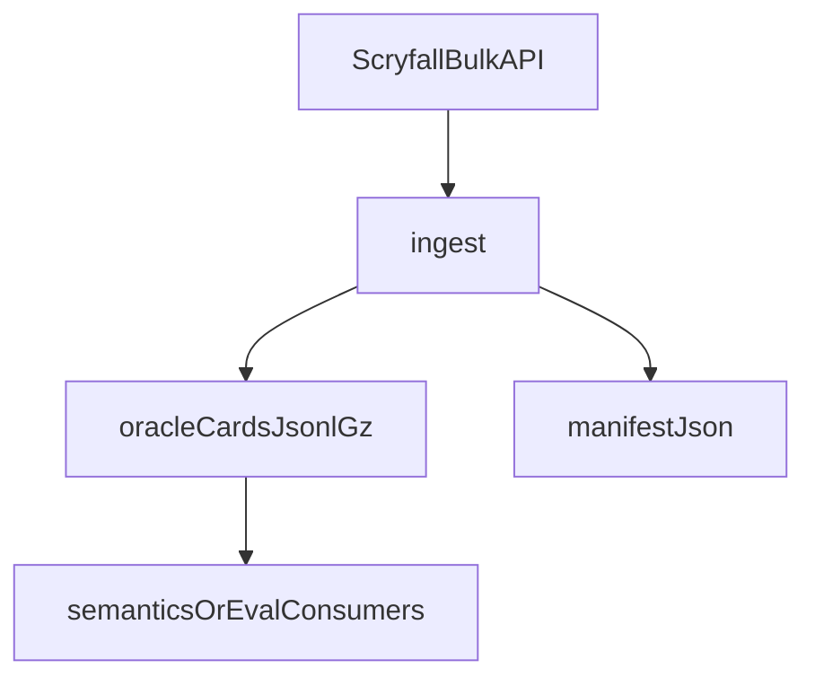

# cards

## Purpose

Scryfall Oracle Cards bulk ingest: versioned local snapshots and content hashing. No compilation or discovery lives here.

## Role in pipeline

Scryfall HTTP bulk API → **THIS** → gitignored `data/scryfall/` snapshots → (later) semantics / eval oracle lookup.

## Inputs

- Scryfall Oracle Cards bulk download metadata and payload (`ingest.fetch_oracle_bulk_info`, `download_oracle_snapshot`).

## Outputs

- Versioned snapshot under `data/scryfall/` (`oracle_cards.jsonl.gz` + `manifest.json` with hashes).
- `load_oracle_cards` → `list[dict]` of raw Scryfall JSON objects (not compiled IR).
- `models.OracleCardRecord` is a thin DTO shape for future typed consumers; **ingest does not currently construct or return it**.

## Responsibilities

- Download, hash, and record Oracle snapshots locally.
- Provide load helpers for offline consumers.

## Non-responsibilities

- Compiling Oracle text (`semantics/`)
- Search, verify, pricing, collections, deckbuilding
- Committing bulk Oracle JSON to git

## Core invariants

- Snapshots stay gitignored (`data/README.md`).
- Manifest hashes are the integrity record for a local snapshot.

## Main entry points

- `ingest.py`: `fetch_oracle_bulk_info`, `download_oracle_snapshot`, `load_oracle_cards`, hashing helpers
- `models.py`: `OracleCardRecord` (DTO; unused by ingest today)
- CLI: `mtg-loop-engine fetch-scryfall`

## Data contracts

Manifest schema round-tripped in `tests/unit/test_scryfall_ingest.py`. Loaded rows carry oracle id, name, oracle text, type line — not IR.

## Failure behavior

HTTP / `RuntimeError` when bulk metadata or download fails. No silent empty snapshot.

## Testing

`tests/unit/test_scryfall_ingest.py` (hash + manifest roundtrip).

## Extension guide

Wire `OracleCardRecord` only when a downstream consumer needs typed records. Prefer leaving IR construction in `semantics/`.

## Bigger-picture relationship

First mile of the Oracle path. Architecture: [`docs/ARCHITECTURE.md`](../../../docs/ARCHITECTURE.md).
