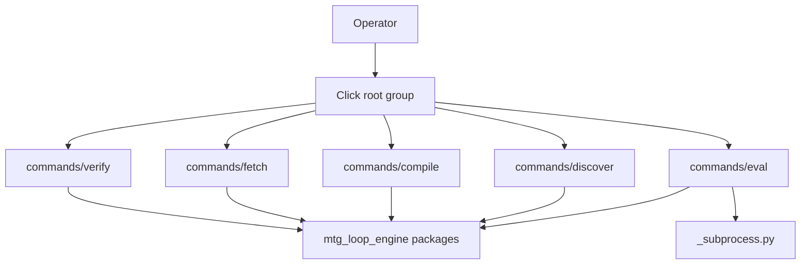

# cli

## Purpose

Thin Click wiring for the `mtg-loop-engine` operator CLI. Commands delegate to library packages; business logic stays out of this folder.

## Context

## What belongs here

- `__init__.py` — root `@click.group`, version flag, command registration
- `commands/` — one module per command family (verify, fetch, compile, discover, eval)
- `_subprocess.py` — managed subprocess lifecycle (Streamlit workbench)

## What does not belong here

- Verifier, search, compiler, or eval domain logic
- CI/docs hygiene scripts (`scripts/`)

## Notes

Operator contract: [`docs/CLI.md`](../../../docs/CLI.md). Agent workflow: [`.agents/skills/click-cli/`](../../../.agents/skills/click-cli/).
