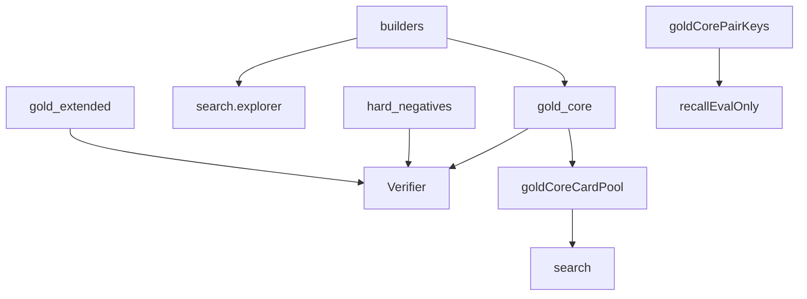

# corpus

## Purpose

Curated gold witnesses and shared board/classification builders. These fixtures are epistemic contracts for the verifier and discovery recall — not live downloads.

## Role in pipeline

Authored IR / witnesses → **THIS** → `verify` tests, `search` card pools, `eval` extras, CLI `verify-gold` / `discover-gold`.

## Inputs

- Manually authored card IR and witness definitions under `gold_core/` / `gold_extended/`

## Outputs

- `LoopWitness` lists (`all_gold_core`, hard negatives, extended catalog)
- Card pools for blind discovery
- Pair key sets for **eval/recall only**

## Responsibilities

- Keep positives, hard negatives, and extended stubs coherent with builders.
- Share `bf` / `two_card` helpers with discovery so witness shapes stay comparable.
- Export pool/key helpers for CLI and tests — not for search internals to cheat.

## Non-responsibilities

- Live Scryfall/Spellbook ingest
- Action search / candidate generation
- Passing pair labels into explorer/discover

## Core invariants

- 10 gold_core positives expected `VERIFIED`
- 9 hard negatives expected typed rejection
- 15 gold_extended stubs expected unsupported-style outcomes without breaking M1
- `gold_core_pair_keys` must not be imported by `search/`

### `strict_two_card` nuance

Builders’ `two_card()` sets `strict_two_card=len(functional)==0` with authored essential count. Discovery stamps `strict_two_card` from **participation** via `analyze_prerequisites`. Do not assume the two definitions are identical.

## Main entry points

- `builders.py`: `witness`, `two_card`, `bf`, `out`, …
- `gold_core/cases.py`: positives, hard negatives, catalogs
- Package helpers: `gold_core_card_pool`, `gold_core_compiled_card_pool`, `gold_core_pair_keys`

## Data contracts

Witnesses use `proofs.models` and `semantics` IR. Changing builder defaults changes both gold and discovered witness shape.

## Failure behavior

Fixture/status mismatches fail tests and `verify-gold` CLI.

## Testing

`tests/gold_core`, `tests/hard_negatives`, `tests/gold_extended`, `tests/discovery`.

## Extension guide

Add a positive only with a verifying witness and a discovery-recall expectation. Add hard negatives with explicit `expected_status`. Prefer extended stubs for unsupported families.

## Bigger-picture relationship

Corpus is the regression spine for M0–M3. Architecture: [`docs/ARCHITECTURE.md`](../../../docs/ARCHITECTURE.md).
