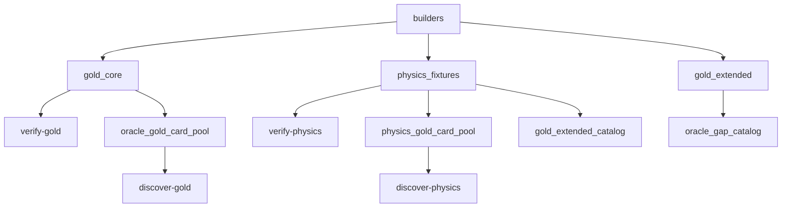

# corpus

## Purpose

Curated witnesses and shared board/classification builders. Epistemic contracts for
the verifier and discovery recall — not live downloads. ADR 0007 splits
**Oracle product gold** from **physics regressions**.

## Role in pipeline

Authored IR / witnesses → **THIS** → `verify` tests, `search` card pools, `eval`
extras, CLI `verify-gold` / `discover-gold` / `verify-physics` / `discover-physics`.

## Inputs

- Oracle-exact witnesses under `gold_core/`
- Synthetic / divergent physics under `physics_fixtures/`
- Curriculum stubs + Oracle gap staging under `gold_extended/`

## Outputs

- `all_gold_core` / Oracle hard negatives (product gold)
- `physics_all_positives` / physics hard negatives
- Card pools and pair keys for blind discovery (Oracle vs physics)
- `oracle_gap_catalog` (Wave 3 blockers; not precision-eligible)

## Responsibilities

- Keep Oracle gold and physics suites separate (ADR 0007).
- Share `bf` / `two_card` helpers with discovery so witness shapes stay comparable.
- Export pool/key helpers for CLI and tests — not for search internals to cheat.

## Non-responsibilities

- Live Scryfall/Spellbook ingest
- Action search / candidate generation
- Passing pair labels into explorer/discover

## Core invariants

- `gold_core` positives are `ORACLE_EXACT`×`ORACLE_EXACT` only (currently **7**)
- Oracle hard negatives accompany promotions (currently **8**)
- Physics suite retains historical synthetic/divergent regressions (**10** positives, **10** hard negatives)
- `gold_extended_catalog` curriculum stubs (**15**) are authored in `physics_fixtures` and re-exported
- Wave 3 remainders (`core_saffi_champion`, `core_mikaeus_triskelion`) and demoted
  `core_heliod_ballista` stay in `oracle_gaps` until primitives / product-legal activation land
- `gold_core_pair_keys` must not be imported by `search/`

## Main entry points

- `builders.py`: `witness`, `two_card`, `bf`, `out`, …
- `gold_core/oracle_cases.py`, `gold_core/hard_negatives.py`
- `physics_fixtures/synthetic_cases.py` (physics positives/HN + `gold_extended_catalog`)
- `gold_extended/oracle_gaps.py`
- Package helpers: `gold_core_card_pool` / `oracle_gold_card_pool`,
  `physics_gold_card_pool`, compiled variants, pair keys

## Testing

`tests/gold_core`, `tests/hard_negatives`, `tests/gold_extended`, `tests/discovery`,
`tests/unit/test_corpus_wave0_split.py`.

## Bigger-picture relationship

Corpus is the regression spine for M0–M5 integrity. Architecture:
[`docs/ARCHITECTURE.md`](../../../docs/ARCHITECTURE.md). ADR 0007.
