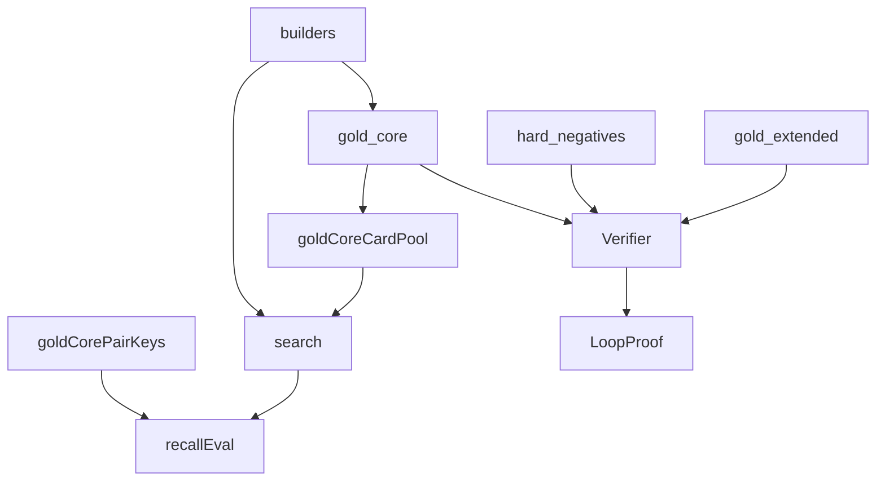

# corpus

## Purpose

Curated gold witnesses for M0/M1 plus eval helpers that strip pair labels for M3 discovery recall.

## Context

## What belongs here

- Manually authored `LoopWitness` fixtures and card IR
- `builders.py`: shared board/classification helpers for gold fixtures **and** discovery (intentional: search emits the same witness shape the verifier already trusts)
- `gold_core_card_pool()` / `gold_core_compiled_card_pool()` / `gold_core_pair_keys()` for CLI and tests only (not search internals)

## What does not belong here

- Action search / candidate generation (see `search/`)
- Live Scryfall/Spellbook downloads (`cards/`, `benchmark/`)
- Pair labels on the discovery path (`gold_core_pair_keys` is eval-only)
