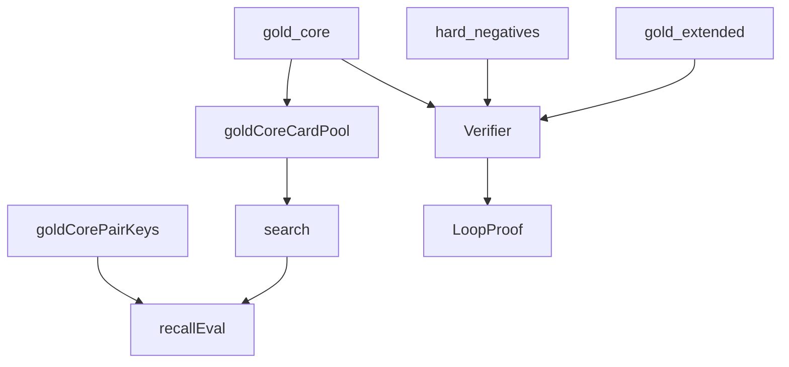

# corpus

## Purpose

Curated gold witnesses for M0/M1 plus eval helpers that strip pair labels for M3 discovery recall.

## Context

## What belongs here

- Manually authored `LoopWitness` fixtures and card IR
- Builders shared across tiers
- `gold_core_card_pool()` / `gold_core_pair_keys()` for CLI and tests only (not search internals)

## What does not belong here

- Action search / candidate generation (see `search/`)
- Live Scryfall/Spellbook downloads (`cards/`, `benchmark/`)
