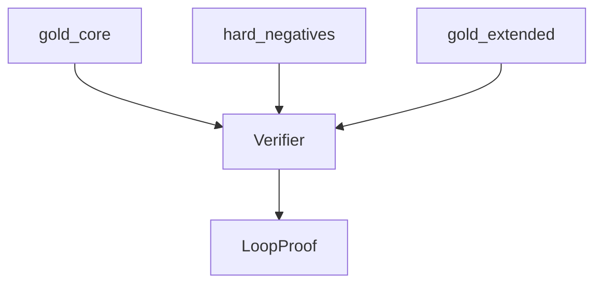

# corpus

## Purpose

Curated gold witnesses for M0/M1: `gold_core` (must verify), `gold_extended` (may be unsupported), and hard negatives with typed expected statuses.

## Context

## What belongs here

- Manually authored `LoopWitness` fixtures and card IR
- Builders shared across tiers

## What does not belong here

- Blind search / candidate generation (M3)
- Live Scryfall/Spellbook downloads (`cards/`, `benchmark/`)
