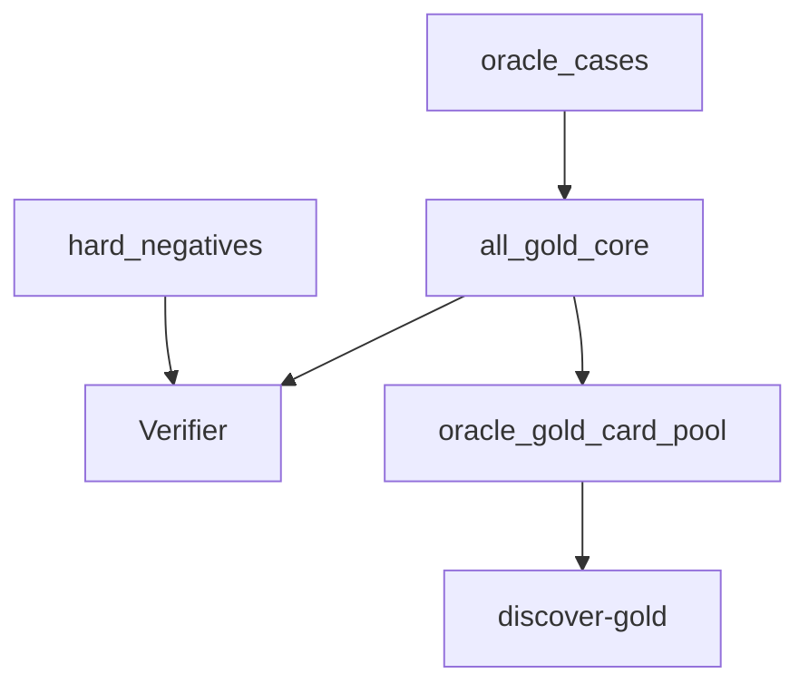

# gold_core

## Purpose

Oracle-exact gold positives and Oracle hard negatives. Product epistemic contract
for verified Magic loops (ADR 0007). Synthetic physics lives under `physics_fixtures/`.

## Role in pipeline

Authored Oracle cases → **THIS** → `Verifier` and `discover-gold` (labels stripped).

## Inputs

- Audited `ORACLE_EXACT` records + compiled semantics
- Handwritten / rediscovered witnesses with **new** IDs (never reuse physics `core_*` claim IDs)

## Outputs

- `all_gold_core()` — currently **8** Oracle positives (Waves 1–3 Heliod)
- `hard_negatives()` — currently **7** Oracle counterfactuals

## Core invariants

- Every positive → `VerificationStatus.VERIFIED`
- Both essentials `ORACLE_EXACT`; semantics compiled from audited records
- Reported `events` and `net_state` match the claim (gross counters alone never justify `ACCUMULATES`)
- Blind discovery rediscovers all positive pairs without pair labels

## Main entry points

- `oracle_cases.py`, `hard_negatives.py`
- Compatibility shim: `cases.py` (re-exports Oracle APIs + physics card IR for unit tests)

## Extension guide

Promote a pair only under the campaign acceptance contract (verify + rediscover +
hard negative + LAR + net/events). Park incomplete real pairs in
`gold_extended/oracle_gaps.py` — do not simplify Oracle to force `COMPLETE`.

## Bigger-picture relationship

Parent: [`../README.md`](../README.md). Physics: [`../physics_fixtures/README.md`](../physics_fixtures/README.md).
