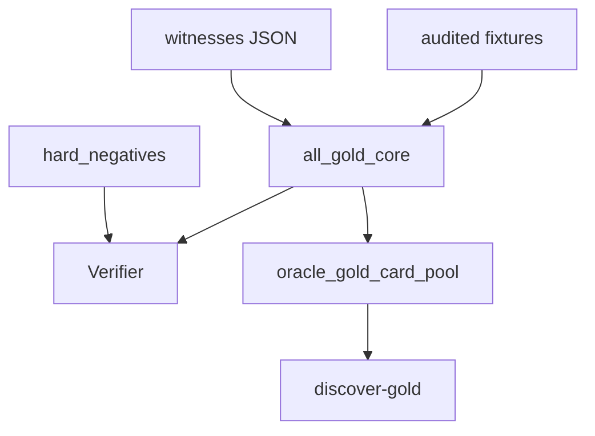

# gold_core

## Purpose

Oracle-exact gold positives and Oracle hard negatives. Product epistemic contract
for verified Magic loops (ADR 0007). Synthetic physics lives under `physics_fixtures/`.

## Role in pipeline

Frozen witness JSON → **THIS** → `Verifier` and `discover-gold` (labels stripped).

## Inputs

- Frozen artifacts under `witnesses/{gold_id}.json` (actions, board, claim)
- Audited `ORACLE_EXACT` fixtures (semantics recompiled on load)

## Outputs

- `all_gold_core()` — currently **9** Oracle positives (Heliod/Ballista re-promoted)
- `hard_negatives()` — currently **8** Oracle counterfactuals

## Core invariants

- Every positive → `VerificationStatus.VERIFIED`
- Both essentials `ORACLE_EXACT`; semantics compiled from audited records
- Gold load never calls `explore_pair` / search (frozen artifacts only)
- Assumptions include `oracle_exact_gold` + `compiled_from_audited_fixture`; never
  `discovered_without_pair_labels` on gold
- Reported `events` and `net_state` match the claim (gross counters alone never justify `ACCUMULATES`)
- Blind discovery rediscovers all positive **pair keys** in `tests/discovery/` (separate suite)

## Main entry points

- `oracle_cases.py`, `witnesses/`, `hard_negatives.py`
- Compatibility shim: `cases.py` (re-exports Oracle APIs + physics card IR for unit tests)
- Re-freeze (deliberate, reviewed): `scripts/freeze_gold_witnesses.py`

## Extension guide

Capture a new pair with the freeze script after verify + rediscover + hard negative +
LAR + net/events. Do not call explore from `all_gold_core`. Park incomplete real pairs
in `gold_extended/oracle_gaps.py` (Saffi / Mikaeus remain).

## Bigger-picture relationship

Parent: [`../README.md`](../README.md). Physics: [`../physics_fixtures/README.md`](../physics_fixtures/README.md).
