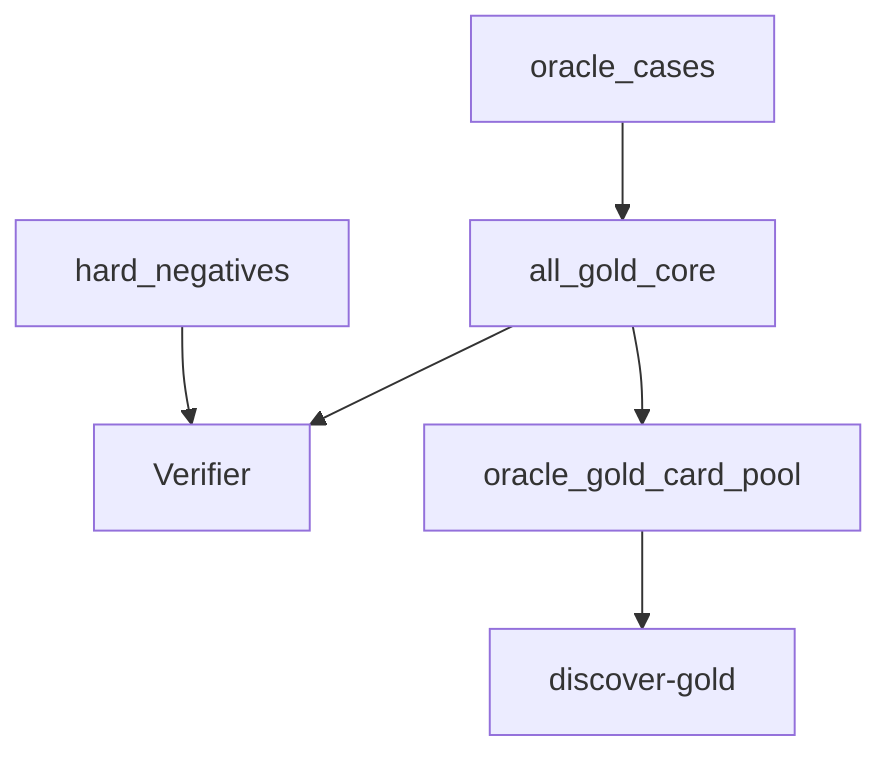

# gold_core

## Purpose

Oracle-exact gold positives and Oracle hard negatives. Product epistemic contract
for verified Magic loops (ADR 0007). Synthetic physics lives under `physics_fixtures/`.

## Role in pipeline

Authored Oracle cases → **THIS** → `Verifier` and `discover-gold` (labels stripped).

## Inputs

- Audited `ORACLE_EXACT` records + compiled semantics
- Handwritten witnesses with new IDs (never reuse physics `core_*` claim IDs)

## Outputs

- `all_gold_core()` — Oracle positives only (Wave 0: empty)
- `hard_negatives()` — Oracle counterfactuals (Wave 0: empty)

## Core invariants

- Every positive → `VerificationStatus.VERIFIED`
- Both essentials `ORACLE_EXACT`; semantics compiled from audited records
- Blind discovery rediscovers all positive pairs without pair labels

## Main entry points

- `oracle_cases.py`, `hard_negatives.py`
- Compatibility shim: `cases.py` (re-exports physics card IR for unit tests)

## Extension guide

Promote a pair only under the campaign acceptance contract (verify + rediscover +
hard negative + LAR + net/events). Prefer `gold_extended/oracle_gaps.py` for
blocked real pairs.

## Bigger-picture relationship

Parent: [`../README.md`](../README.md). Physics: [`../physics_fixtures/README.md`](../physics_fixtures/README.md).
