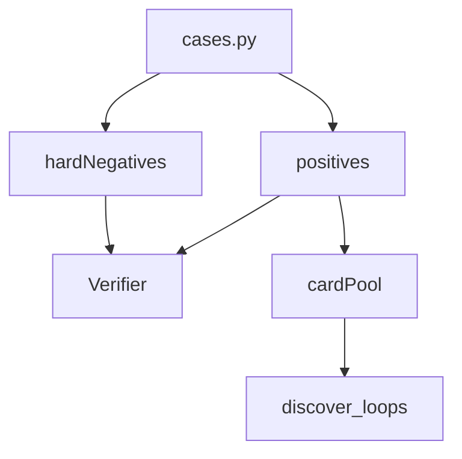

# gold_core

## Purpose

Ten positive two-card loop witnesses that must verify, plus nine hard-negative witnesses that must reject with specific statuses. Core epistemic contract for M1 and blind-discovery recall.

## Role in pipeline

Authored cases → **THIS** → `Verifier` (positives/negatives) and card pool → `search` (labels stripped).

## Inputs

- Hand-authored card IR constants and `LoopWitness` definitions in `cases.py`

## Outputs

- Positive witnesses (`gold_core_positives` / `all_gold_core`)
- Hard-negative witnesses with `expected_status`
- Pool/key helpers at package level for tests/CLI

## Responsibilities

- Remain the minimal “known good / known bad” set for verifier correctness and discovery recall.
- Keep Oracle fixtures aligned for the compiled seam (`semantics.oracle_fixtures`).

## Non-responsibilities

- Extended unsupported stubs (`gold_extended/`)
- Spellbook reference rows
- Pair labels inside search

## Core invariants

- Every positive → `VerificationStatus.VERIFIED`
- Every hard negative → exact expected typed rejection (not mere failure)
- Discovery without pair labels rediscovers all positive pairs (M3 / M3.5)

## Main entry points

- `cases.py` — card constants, witness factories, catalogs
- Consumers: `tests/gold_core`, `tests/hard_negatives`, `tests/discovery`, CLI `verify-gold` / `discover-gold`

## Data contracts

Witness IDs and oracle IDs are stable references for golden proofs and eval fixture detection.

## Failure behavior

Any status drift fails CI. Treat failures as contract breaks, not flaky tests.

## Testing

`tests/gold_core/test_positives.py`, `tests/hard_negatives/`, discovery recall tests.

## Extension guide

Prefer extending `gold_extended` for new unsupported families. Grow gold_core only when a new family is both verified and intended as a permanent regression anchor.

## Bigger-picture relationship

Parent: [`../README.md`](../README.md). Architecture: [`docs/ARCHITECTURE.md`](../../../../docs/ARCHITECTURE.md).
