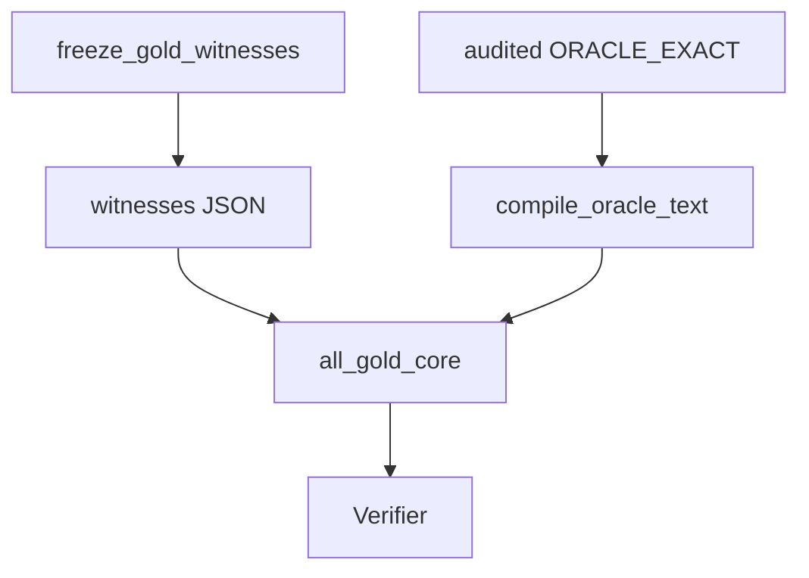

# witnesses

## Purpose

Frozen Oracle gold_core witness artifacts — independently reviewable JSON, one
file per `gold_id`. Loaded by `oracle_cases.all_gold_core()` without search.

## Role in pipeline

Deliberate freeze (`scripts/freeze_gold_witnesses.py`) → **THIS** → loader
recompiles `card_semantics` from audited fixtures → `Verifier` / CLI
`verify-gold`. Blind rediscovery is a separate discovery-suite contract.

## What belongs here

- One `{gold_id}.json` per product-gold positive (actions, board, claim fields)
- Assumptions `oracle_exact_gold` and `compiled_from_audited_fixture`

## What does not belong here

- Live `explore_pair` / promote-at-import
- `discovered_without_pair_labels` (discovery-only)
- Embedded `card_semantics` as source of truth (recompiled on load)
- Heliod / Ballista (staged in `gold_extended/oracle_gaps`)

## Notes

Re-freeze only after human review: `uv run python scripts/freeze_gold_witnesses.py`.
Use `--check` to detect drift vs a fresh explore capture without writing.
