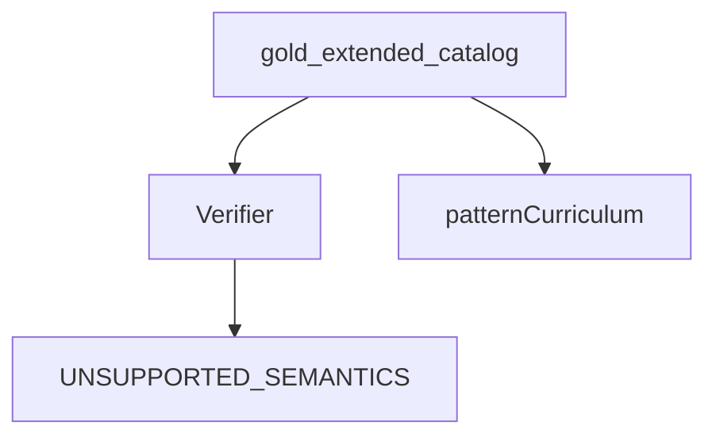

# gold_extended

## Purpose

Fifteen stub witnesses for unsupported / partial-relevant families. They document known gaps without expanding the verified gold_core spine. Still active through M4 as the fail-closed curriculum for pattern growth.

## Role in pipeline

Stub catalog → **THIS** → verifier expects unsupported-style rejection → curriculum signal for pattern work.

## Inputs

- Authored stub witnesses with `PARTIAL_RELEVANT_TO_PROOF` (or similar unsupported markers) in `gold_core/cases.py` catalog helpers / extended entries

## Outputs

- Catalog of stubs that must not claim `VERIFIED`

## Responsibilities

- Hold explicit “not yet supported” contracts so the suite stays honest about coverage gaps.
- Avoid breaking gold_core positives when new unsupported families are recorded.

## Non-responsibilities

- Verified positives (gold_core)
- Live Spellbook rows (benchmark/eval)

## Core invariants

- Stubs must not silently become `VERIFIED` without an intentional gold_core promotion.
- Coverage remains fail-closed for proof-relevant gaps.

## Main entry points

- Extended catalog accessors used by `tests/gold_extended/`

## Data contracts

Same `LoopWitness` schema as gold_core; expected statuses are unsupported / rejection typed.

## Failure behavior

If a stub suddenly verifies, tests should fail — that is a signal to either promote it deliberately or fix an over-eager pattern.

## Testing

`tests/gold_extended/`

## Extension guide

Add a stub when Spellbook/real Oracle shows a family the compiler cannot honor yet. Promote to gold_core only with a full verifying witness + discovery expectation.

## Bigger-picture relationship

Parent: [`../README.md`](../README.md). Pattern growth path: [`../../semantics/patterns/README.md`](../../semantics/patterns/README.md).
