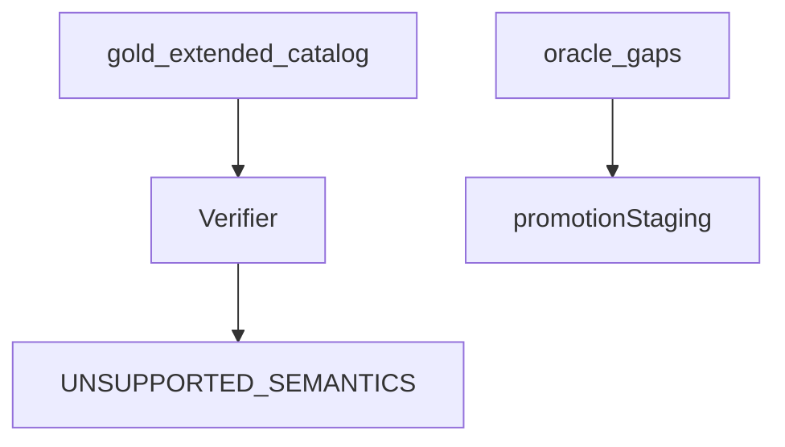

# gold_extended

## Purpose

Unsupported / partial-relevant stub witnesses plus staging for real Oracle pairs
blocked by missing physics (`oracle_gaps.py`). Documents known gaps without
claiming product gold.

## Role in pipeline

## What belongs here

- Authored stubs with `PARTIAL_RELEVANT_TO_PROOF` / unsupported markers
- Real pairs awaiting Wave 2/3 primitives (`oracle_gap_catalog`)

## What does not belong here

- Verified Oracle gold (`gold_core/`)
- Synthetic physics regressions (`physics_fixtures/`)

## Main entry points

- `gold_extended_catalog` (physics-adjacent stubs; still used by CLI smoke)
- `oracle_gap_catalog`

## Testing

`tests/gold_extended/`

## Bigger-picture relationship

Parent: [`../README.md`](../README.md).
