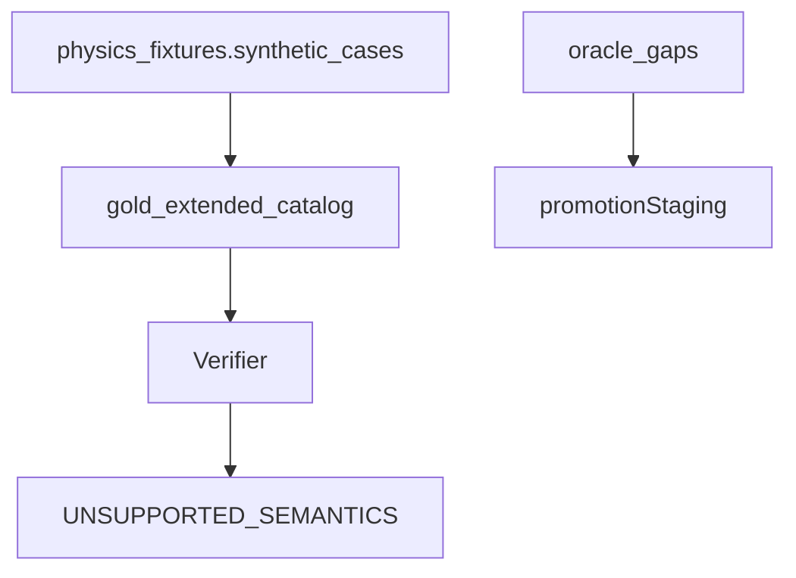

# gold_extended

## Purpose

Unsupported / partial-relevant curriculum stubs plus staging for real Oracle pairs
blocked by missing physics (`oracle_gaps.py`). Documents known gaps without
claiming product gold.

## Role in pipeline

## What belongs here

- Package re-export of `gold_extended_catalog` (**15** stubs; body still authored under
  `physics_fixtures/synthetic_cases.py` for historical continuity)
- Real pairs awaiting remaining Wave 3 / product-legal primitives (`oracle_gap_catalog`:
  `core_saffi_champion`, `core_mikaeus_triskelion`, `core_heliod_ballista`). Mikaeus notes:
  SBA/undying/self-ping physics landed; promotion still needs audited Oracle + grant/anthem
  compile + gold witness. Saffi still needs delayed triggers. Heliod demoted: fixtures
  retained; do not re-promote until two-counter 0/0 start + paid lifelink activation
  (no `seed_grant_lifelink` on product witnesses).

## What does not belong here

- Verified Oracle gold (`gold_core/`)
- Synthetic physics positives / hard negatives (`physics_fixtures/` suites)

## Main entry points

- `gold_extended_catalog` (re-export)
- `oracle_gap_catalog` / `OracleGap` in `oracle_gaps.py`

## Testing

`tests/gold_extended/`

## Bigger-picture relationship

Parent: [`../README.md`](../README.md). Physics host of stubs:
[`../physics_fixtures/README.md`](../physics_fixtures/README.md).
