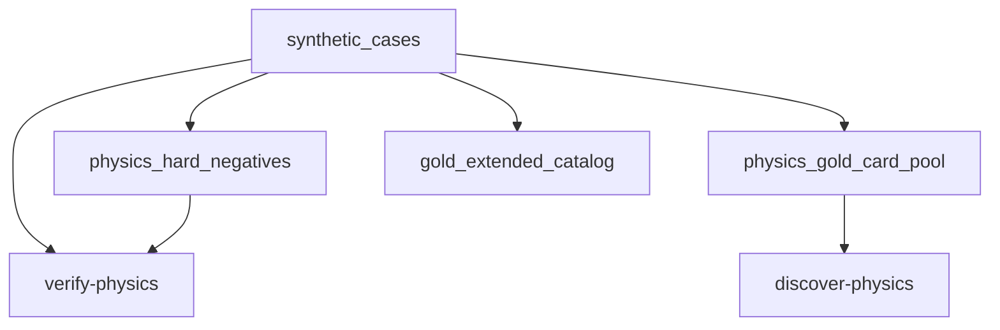

# physics_fixtures

## Purpose

Synthetic and `ORACLE_DIVERGENT` executor regression witnesses. These defend engine
physics; they are never product-precision eligible (ADR 0007).

## Context

## What belongs here

- Historical `core_*` synthetic/divergent positives (**10**; retained IDs)
- Physics-tied hard negatives (**10**; includes `neg_nondeterministic`)
- Card IR constants used by unit/executor tests
- Curriculum unsupported stubs via `gold_extended_catalog()` (**15**) — re-exported by `gold_extended/` for CLI smoke

## What does not belong here

- Audited `ORACLE_EXACT` gold witnesses (`gold_core/`)
- Product precision denominators
- Wave 3 Oracle gap staging (`gold_extended/oracle_gaps.py`)

## Module layout

| Module | Role |
| --- | --- |
| `synthetic_cases.py` | Positives, physics hard negatives, `gold_extended_catalog`, card IR |
| `hard_negatives.py` | Thin re-export of `physics_hard_negatives` |

## Notes

Oracle gold: [`../gold_core/README.md`](../gold_core/README.md). Parent invariants:
[`../README.md`](../README.md). Provenance: ADR 0007.
