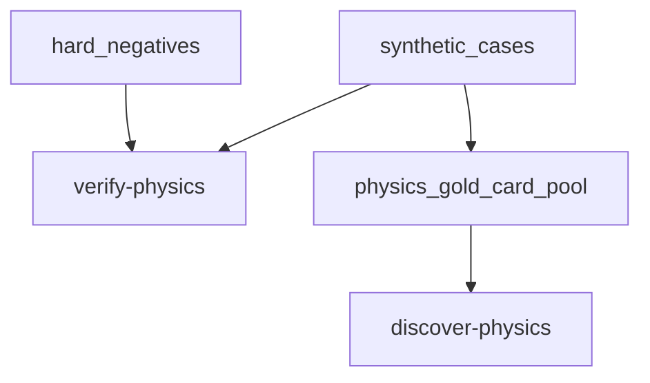

# physics_fixtures

## Purpose

Synthetic and `ORACLE_DIVERGENT` executor regression witnesses. These defend engine
physics; they are never product-precision eligible (ADR 0007).

## Context

## What belongs here

- Historical `core_*` synthetic/divergent positives (retained IDs)
- Physics-tied hard negatives
- Card IR constants used by unit/executor tests

## What does not belong here

- Audited `ORACLE_EXACT` gold witnesses (`gold_core/`)
- Product precision denominators

## Notes

Oracle gold: [`../gold_core/README.md`](../gold_core/README.md). Provenance: ADR 0007.
