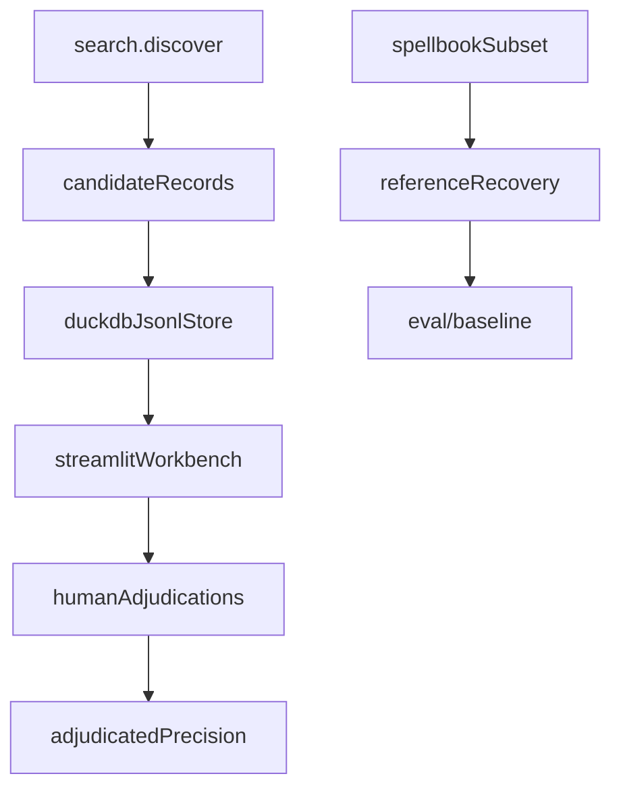

# eval

## Purpose

M4 research instrumentation: prerequisite analysis, Spellbook **reference recovery**, human-adjudicated **precision**, persistence, and the Streamlit workbench.

This package measures the engine. It is not the M7 explorer.

## Role in pipeline

Discoveries / Spellbook subsets / adjudications → **THIS** → recovery & precision reports → committed artifacts under repo-root `eval/` + optional `data/eval/` DuckDB.

## Inputs

- Discovered witnesses / proofs
- Spellbook conventional rows (snapshot or fixtures)
- Human adjudication classes

## Outputs

- `RecoveryReport`, `PrecisionReport`
- JSONL / DuckDB records
- Workbench UI narratives

## Responsibilities

| Concern | Module | Meaning |
| --- | --- | --- |
| Reference recovery | `spellbook_eval.py`, `metrics.py` | Among **eligible/supported** reference rows, how many rediscover? Stages: compile → join → search → optional prerequisite mismatch → recovered. |
| Human-adjudicated precision | `metrics.precision_from_records` | Among adjudicated **real-card** accepted discoveries, how many are valid classes? |
| Prerequisite analysis | `classify.py` | Participation / assumptions / `strict_two_card` **detection** |
| Persistence / UX | `store.py`, `workbench.py`, `narrate.py`, `glossary.py`, `explain.py` | Reviewer workflow |

### Spellbook absence ≠ false positive

Accepted discoveries missing from Spellbook are `ABSENT_FROM_REFERENCE` (or similar reference status). They are **not** counted as false positives. `NOVEL` requires human adjudication (M5). See [`docs/EVALUATION.md`](../../../docs/EVALUATION.md).

### Detection vs enforcement

`analyze_prerequisites` detects unused searched cards and sets `strict_two_card`. **Search enforces** that flag in `explore_pair` (accept only `VERIFIED` + `strict_two_card`). This package still owns detection and measurement; it does not own the acceptance gate.

## Non-responsibilities

- FastAPI / Postgres / public explorer (M7)
- LLM parsing
- Tightening joins to chase unlabeled extras
- Verifier-side participant rejection (optional follow-up; discovery already filters)

Committed baseline *files* live under repo-root `eval/baseline/`. This package **does** write/read them (e.g. `gold_extras.persist_gold_pool_extras` → `m4_gold_pool_summary.json`); the artifact tree is the committed home, not a separate owner.

LAR v2 contracts (`lar_contracts.py`, `lar_calibration.py`) support ephemeral runs under `data/eval/lar/runs/` and durable calibration loading from `eval/calibration/`.

## Core invariants

- Precision denominator excludes skipped and `INVALID_CANDIDATE_DATA` (fixture pairs).
- Recovery recall is undefined / null when eligible count is 0.
- Gold-extra persistence expects adjudications to cover **currently discovered** extras (10-row post-gate contract in tests). Frozen baseline JSON may still show the pre-gate 24-row snapshot until ROADMAP item 5.

## Main entry points

| Module | Role |
| --- | --- |
| `classify.py` | `analyze_prerequisites` |
| `schema.py` | Adjudication classes / records |
| `metrics.py` | Recovery + precision reports |
| `spellbook_eval.py` | Reference subset evaluation |
| `gold_extras.py` | Gold-pool extras snapshot / summary |
| `store.py` | DuckDB + JSONL |
| `workbench.py` | Streamlit UI |
| `oracle_lookup.py` | Optional real Oracle text lookup |

CLI: `eval-gold-extras`, `eval-spellbook`, `adjudicate-workbench`.

## Data contracts

Committed outputs land in repo-root `eval/` (fixtures, adjudications, baselines). Working DuckDB defaults under gitignored `data/eval/`.

## Failure behavior

`RuntimeError` when gold extras count disagrees with adjudication coverage. Recovery stages record miss reasons without claiming precision.

## Testing

`tests/eval/` — classify (including bystander detection), store roundtrip, sample recovery 2/2, extras↔adjudications, narrate helpers.

## Extension guide

1. Change denominators only with docs + baseline updates.
2. Keep workbench educational; do not hide adjudication classes.
3. Participant enforcement belongs in search/verify — update classify tests when it lands.

## Bigger-picture relationship

Eval sits above the engine. Architecture: [`docs/ARCHITECTURE.md`](../../../docs/ARCHITECTURE.md). Artifact layout: [`../../../eval/README.md`](../../../eval/README.md).
