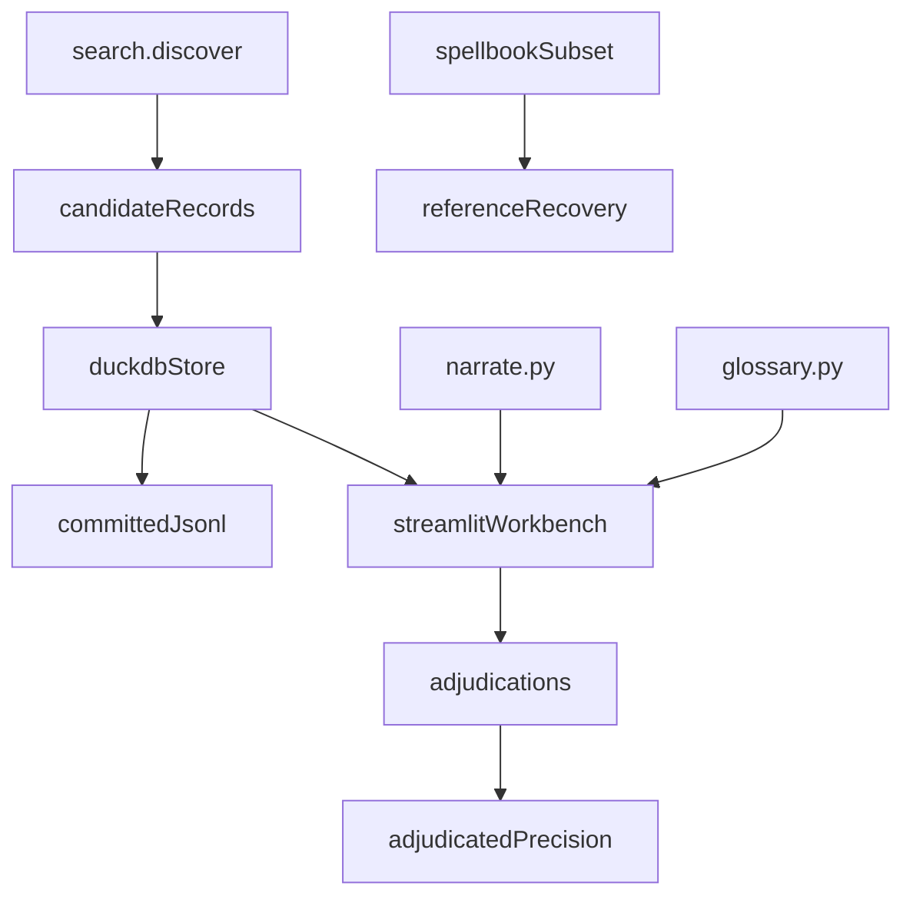

# eval

## Purpose

M4 evaluation layer: compiled-pool helpers live in `corpus/`; this package owns adjudication persistence, prerequisite analysis, Spellbook reference recovery, and the Streamlit workbench. It is a research instrument, not the M7 explorer.

## Context

## What belongs here

- `schema.py`: adjudication classes and evaluation records
- `classify.py`: starting-state assumptions and essential-piece analysis
- `explain.py`: reviewer-facing proof prose (JSON is secondary)
- `store.py`: DuckDB + JSONL persistence
- `gold_extras.py`: snapshot gold-pool extras (no pair labels into search)
- `metrics.py` / `spellbook_eval.py`: reference recovery and precision reports
- `oracle_lookup.py`: optional Scryfall named lookup for real Oracle text
- `narrate.py`: plain-English loop narrative and Scryfall card image URL helper
- `glossary.py`: MTG jargon definitions (tap, sacrifice, ETB, …) for the tutorial workbench
- `workbench.py`: Streamlit adjudication UI with tutorial mode — card images, plain-English steps, inline glossary, adjudication class guide, and a gold-core study tab

## Tutorial mode (workbench)

The workbench has two tabs:

1. **Review candidates** — the adjudication queue. Each card shows a Scryfall image, oracle text with highlighted jargon, a plain-English loop walkthrough, and collapsible technical detail. Adjudication controls are unchanged.
2. **Study gold-core loops** — browse all 10 verified gold-core loops by name. Useful before reviewing any new candidates — these are the "ground truth" examples.

The sidebar also includes:
- **How to adjudicate** — a guide to each `AdjudicationClass` with a worked example.
- **MTG glossary** — definitions for common jargon (tap, sacrifice, ETB, mana ability, etc.).

## What does not belong here

- FastAPI, Postgres, React, auth, or a public explorer (M7)
- LLM parsing
- Tightening joins to chase unlabeled extras
