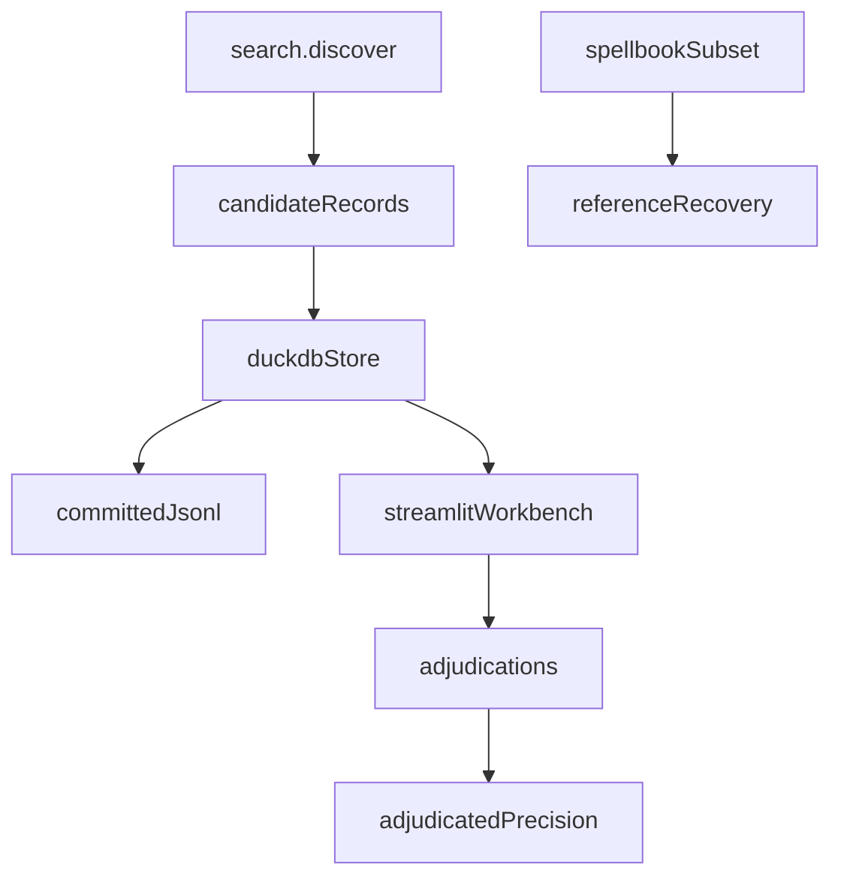

# eval

## Purpose

M4 evaluation layer: compiled-pool helpers live in `corpus/`; this package owns adjudication persistence, prerequisite analysis, Spellbook reference recovery, and the Streamlit workbench. It is a research instrument, not the M7 explorer.

## Context

## What belongs here

- `schema.py`: adjudication classes and evaluation records
- `classify.py`: starting-state assumptions and essential-piece analysis
- `explain.py`: reviewer-facing proof prose (JSON is secondary)
- `store.py`: DuckDB + JSONL persistence
- `gold_extras.py`: snapshot gold-pool extras (no pair labels into search)
- `metrics.py` / `spellbook_eval.py`: reference recovery and precision reports
- `oracle_lookup.py`: optional Scryfall named lookup for real Oracle text
- `workbench.py`: local Streamlit adjudication UI

## What does not belong here

- FastAPI, Postgres, React, auth, or a public explorer (M7)
- LLM parsing
- Tightening joins to chase unlabeled extras
