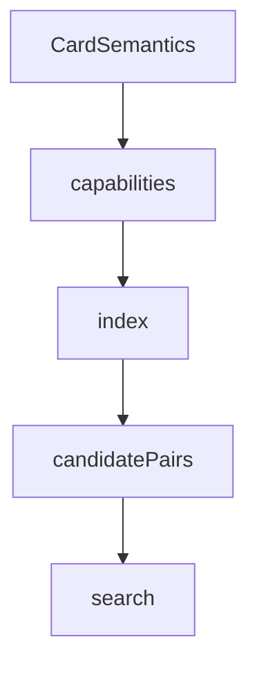

# interactions

## Purpose

Capability signatures and inverted indexes used to prune two-card pair generation before search.

## Context

## What belongs here

- `capabilities.py`: produces / requires / triggers / modifies extracted from IR
- `index.py`: inverted maps and complementary pair joins

## What does not belong here

- Action-sequence search (see `search/`)
- Verification (see `verify/`)
