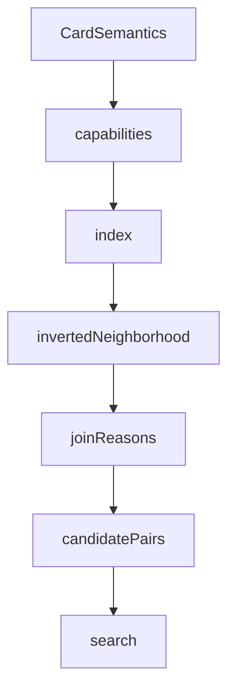

# interactions

## Purpose

Capability signatures and inverted-index neighborhoods used to propose two-card pairs before search. `join_reasons` confirms each neighborhood pair.

## Context

## What belongs here

- `capabilities.py`: produces / requires / triggers / modifies extracted from IR; `join_reasons`
- `index.py`: inverted maps (`by_produces`, `by_requires`, `by_triggers`, `by_modifies`) and `candidate_pairs()`

## What does not belong here

- Action-sequence search (see `search/`)
- Verification (see `verify/`)
