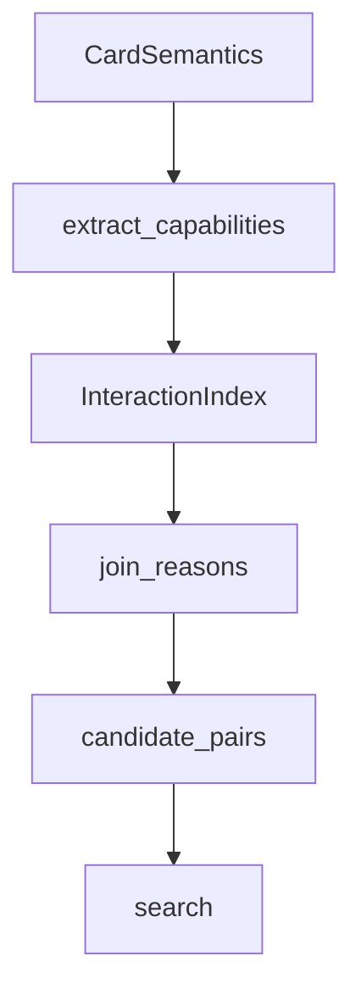

# interactions

## Purpose

Capability signatures and inverted-index neighborhoods that **propose** complementary two-card pairs before search. Joins do not decide whether a loop is true.

## Role in pipeline

`list[CardSemantics]` → **THIS** → `CandidatePair` stream → `search.discover_loops` / explorer.

## Inputs

- Compiled cards with IR abilities and coverage

## Outputs

- Unordered candidate pairs with non-empty `join_reasons` (`etb_trigger`, cost reduce, mana complements, …)

## Responsibilities

- Extract produces / requires / triggers / modifies capabilities.
- Enumerate complementary neighborhoods via inverted maps.
- Drop cards with `relevant_unsupported()` at index construction.
- Drop pairs with empty join reasons.

## Non-responsibilities

- Action-sequence search (`search/`)
- Verification / acceptance (`verify/`)
- Human adjudication (`eval/`)

## Core invariants

- Propose only: a join hit is necessary for blind discovery, not sufficient for truth.
- Proof-relevant unsupported cards never enter the index.
- Empty-reason pairs never emit.

## Main entry points

- `capabilities.py`: `CardCapabilities`, `extract_capabilities`, `join_reasons`
- `index.py`: `InteractionIndex`, `CandidatePair`, `candidate_pairs()`

## Data contracts

`CandidatePair` carries two oracle ids / cards plus reason strings consumed by discovery reporting and Spellbook stage breakdown (`CANDIDATE_JOIN_MISS`).

## Failure behavior

Misses surface as eval stage `candidate_join_miss`, not as verifier statuses. Index silently excludes unsupported cards (by design).

## Testing

`tests/unit/test_interactions.py`; discovery tests assert gold pairs appear in joins.

## Extension guide

Add capability flags and `join_reasons` cases when new IR families need neighborhood discovery. Do **not** tighten joins solely to hide `ABSENT_FROM_REFERENCE` extras (M5 policy).

## Bigger-picture relationship

Joins are the funnel into search. Architecture: [`docs/ARCHITECTURE.md`](../../../docs/ARCHITECTURE.md).
