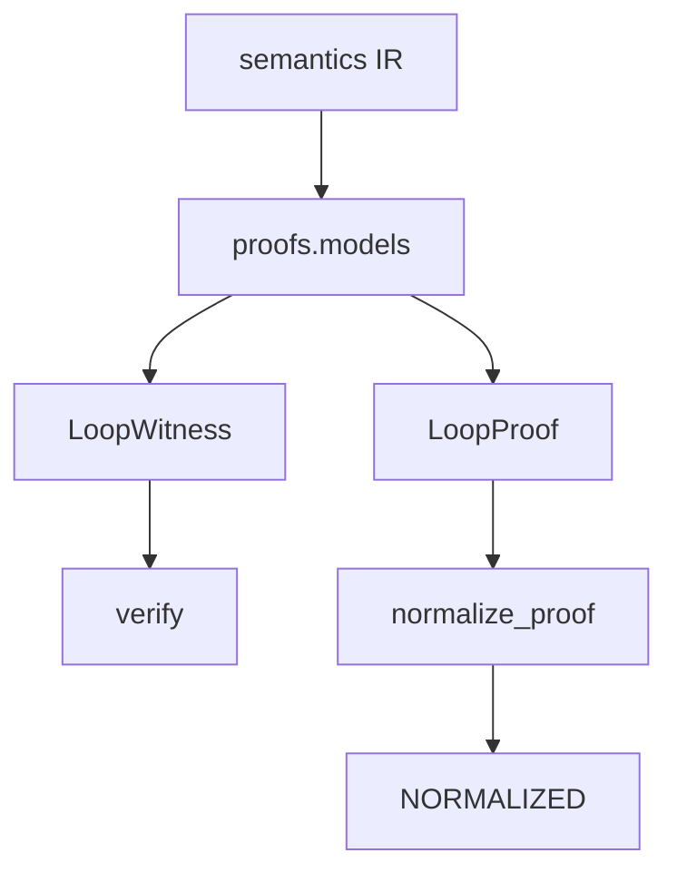

# proofs

## Purpose

Shared pydantic contracts for witnesses, proofs, classification, actions, and normalization. Schema only — no execution or search.

## Role in pipeline

Authored / discovered structures → **THIS models** → `verify`, `search`, `corpus`, `eval`, golden proof tests.

## Inputs

- Field values from corpus builders, explorer, and verifier

## Outputs

- Validated `LoopWitness`, `LoopProof`, `Classification`, `ActionStep`, recurrence/output models
- Normalized proof artifacts via `normalize.py`

## Responsibilities

- Define the epistemic wire format between discovery, verification, and evaluation.
- Provide `normalize_proof` for stable golden comparison.

## Non-responsibilities

- Running the executor or BFS
- Compiling Oracle text
- Adjudication labels (those live in `eval.schema`)

## Core invariants

- Witness carries `semantic_coverage` and `classification` for verifier gates.
- `strict_two_card` on classification is a **label**; today it is not alone sufficient to force verifier rejection (see search open defect).
- Normalization must be deterministic for golden proofs.

## Main entry points

- `models.py`: `LoopWitness`, `LoopProof`, `Classification`, `ActionStep`, …
- `normalize.py`: `normalize_proof`

## Data contracts

Pydantic models are the cross-package API. Changing fields is a breaking contract for corpus fixtures and eval JSONL.

## Failure behavior

Validation errors on malformed structures. Normalization produces an explicit `NORMALIZED` kind for golden tests.

## Testing

`tests/golden_proofs/` — JSON / hash / normalize as executable epistemic contracts.

## Extension guide

Prefer additive optional fields with defaults. Update corpus fixtures and golden proofs in the same change.

## Bigger-picture relationship

Proofs are the shared language of the acceptance boundary. Architecture: [`docs/ARCHITECTURE.md`](../../../docs/ARCHITECTURE.md).
