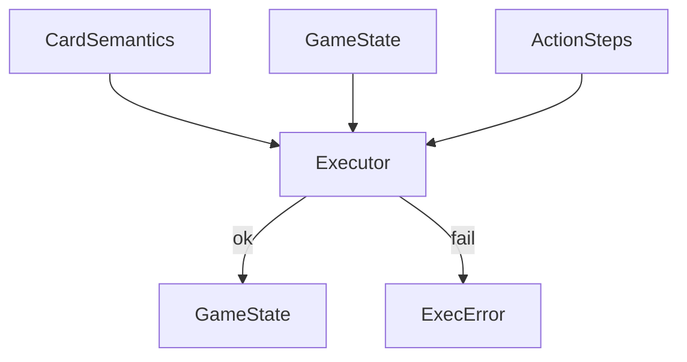

# rules

## Purpose

Modeled Comprehensive Rules subset: execute costs, effects, simple triggers, cost modifiers, and replacements against `GameState`.

## Role in pipeline

`CardSemantics` + `ActionStep` sequences → **THIS (`Executor`)** → mutated `GameState` or typed `ExecError` → consumed by `verify` and `search`.

## Inputs

- Semantics map (`oracle_id → CardSemantics`)
- `GameState` and `ActionStep` / sequences from proofs models

## Outputs

- Updated `GameState` on success
- `ExecError` with status/message on illegal or resource-failing steps

## Responsibilities

- Replay setup and loop actions faithfully within the modeled rules surface.
- GY activations when abilities return to battlefield; optional `requires_zombie` gate for cast-from-GY shapes.
- Combo-player favorable / opponent adversarial choice ownership (see executor docstring and frozen product decisions).
- Explicit sacrifice / host-tap target revalidation (BF, controller, creature/token selectors); invalid explicit objects → `ILLEGAL_TARGET`.
- Exact pending-trigger match when `actor` / `ability_id` are supplied (no silent idx-0 fallback).
- Exile-on-death replacements suppress death events and `DIES` triggers (CR 700.4); sacrifice events still fire.
- Summoning sickness blocks `{T}` / `TapCost` even on mana abilities (CR 302.6); haste not modeled.

## Non-responsibilities

- Pair discovery or BFS (`search/`)
- Full CR implementation
- Accepting or rejecting loops as proofs (`verify/` owns that)

## Core invariants

- Execution errors become typed verification failures upstream — no silent illegal success.
- Cost reduction and trigger resolution must match what patterns claim to support.
- `ManaAmount.any_color` models "mana of any color": it may pay W/U/B/R/G (or generic), but generic mana still cannot pay colored costs.
- Adversarial witnesses (targets/triggers the explorer would never emit) must still fail closed.

## Main entry points

- `executor.py`: `Executor`, `ExecError`, `run_step` / `run_sequence`

## Data contracts

Action ops and effect shapes from `semantics` / `proofs.models`. Statuses align with `VerificationStatus` vocabulary where applicable (`RESOURCE_DEFICIT`, `ILLEGAL_ACTION`, …).

## Failure behavior

Return `ExecError` rather than mutating into an illegal board. Verifier maps these into rejection proofs.

## Testing

Indirect via gold_core, hard_negatives, explorer unit tests, and compile→verify seam tests.
Soundness unit contracts: `tests/unit/test_executor_soundness.py`, `tests/unit/test_once_per_turn_recurrence.py`.

## Extension guide

To add a **rule primitive** (new modeled cost, effect, trigger, or replacement the engine can execute): extend `executor.py` only when a new semantic pattern requires that physics. Keep search free of rules special-cases that belong here. Pair every new capability with a hard-negative or gold regression when it changes acceptance.

## Bigger-picture relationship

Rules are the physics under the acceptance boundary. Architecture: [`docs/ARCHITECTURE.md`](../../../docs/ARCHITECTURE.md).
