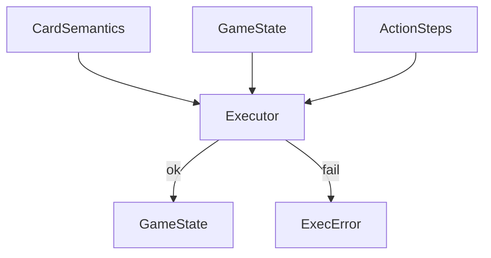

# rules

## Purpose

Modeled Comprehensive Rules subset: execute costs, effects, simple triggers, cost modifiers, and replacements against `GameState`.

## Role in pipeline

`CardSemantics` + `ActionStep` sequences → **THIS (`Executor`)** → mutated `GameState` or typed `ExecError` → consumed by `verify` and `search`.

## Inputs

- Semantics map (`oracle_id → CardSemantics`)
- `GameState` and `ActionStep` / sequences from proofs models

## Outputs

- Updated `GameState` on success
- `ExecError` with status/message on illegal or resource-failing steps

## Responsibilities

- Replay setup and loop actions faithfully within the modeled rules surface.
- GY activations when abilities return to battlefield; optional `requires_zombie` gate for cast-from-GY shapes.
- Combo-player favorable / opponent adversarial choice ownership (see executor docstring and frozen product decisions).
- Explicit sacrifice / host-tap target revalidation (BF, controller, creature/token/land selectors); invalid explicit objects → `ILLEGAL_TARGET`.
- Enchanted `{T}` hosts: `TapCost.host="creature"` (Gond) requires creature + not summoning sick; `host="land"` (Nest) requires a land (no sickness).
- Exact pending-trigger match when `actor` / `ability_id` are supplied (no silent idx-0 fallback).
- Exile-on-death replacements suppress death events and `DIES` triggers (CR 700.4); sacrifice events still fire.
- Creature `DIES` queues carry subject `effective_toughness()` as trigger `amount` when > 0 (South Wind Avatar class).
- `MoveToZoneEffect` bounce targets: `controlled_creature`, `controlled_creature_green_or_white`, `controlled_permanent`, `controlled_nonland`, `other_controlled_creature` (Temur), `other_controlled_sharing_type` (Cloudstone; needs trigger subject), `target_nonland` (Knack/Helix).
- `TriggeredAbility.filter` includes `controlled_nonartifact` (Cloudstone).
- Mana Echoes: `AddManaEffect` `CONTROLLED_SHARING_CREATURE_TYPE` counts controlled creatures sharing a creature subtype with the trigger subject (token names infer subtypes when unregistered).
- `TapCreatureCost` (Earthcraft): tap an untapped controlled creature as a cost (not the creature's own `{T}` — summoning sickness does not apply). `UntapEffect(target_basic_land)`. Optional `ActionStep.cost_target` selects the creature when `target` is the land (Signaler vs token).
- `HybridManaCost` ({B/G}) and `RemoveCounterCost` (Quillspike): pay one of the listed colors; remove m1m1 from a controlled creature.
- Holding priority: while triggers are pending, explorer may activate `TapCreatureCost` abilities before resolving ETB bounce (Drake + Earthcraft).
- `cast_from_hand`: creature from `Zone.HAND` pays `CardSemantics.mana_cost`, or free under `FreeCastCreaturesByManaValue` (Aluren) when MV ≤ ceiling; bumps `events.cast` then ETB.
- `activate_granted_tap_bounce` / `seed_grant_tap_bounce`: Instant grant `{T}`: bounce nonland (`Permanent.tap_bounce_nonland`, witness-persistent).
- BF tapped→untapped via `_untap_permanent` queues `TriggerEvent.UNTAP` (Mesmeric Orb); self-mill bumps `events.mill` only.
- Summoning sickness blocks `{T}` / `TapCost` even on mana abilities (CR 302.6); haste not modeled.
- State-based actions after each successful `run_step`: creatures you control die on toughness ≤ 0 or lethal `damage_marked` (CR 704.5f/g); cascades bounded.
- Undying seed (`seed_grant_undying`) and synthetic `__undying_return__` trigger: return with +1/+1 iff zero p1p1 at death (CR 702.92a/c); no card-ability lookup.
- Lifelink seed (`seed_grant_lifelink`) is a **physics stand-in** only — not product-legal for
  `ORACLE_EXACT` witnesses (verifier quarantines). Product Heliod uses `GrantLifelinkEffect`
  from a paid `{1}{W}` activation.
- `DealDamageEffect` `any_target`: opponent life when `step.target` is `None`/`opponent`; mark damage on a BF creature id (self-ping legal when `target == actor`).
- `DealDamageEffect.amount_from_trigger`: Shalai-class “that much” damage from `COUNTER_ADDED` amount.
- `ReplacementAmplifyP1P1Counters` (Kami / Hardened Scales): +1/+1 puts become that many plus one; creature vs permanent scope; multiple sources stack.
- Power-scaled tap mana (`equal_to_source_power`) uses `Permanent.effective_power()` (printed ± counters).
- `AddCounterEffect.amount_from_trigger` + `target=enchanted_creature`: Sunbond / Light of Promise put that many +1/+1 on the host creature (explorer supplies the host target; no attachment graph yet).
- `AddCounterEffect.target=each_controlled_creature`: Archangel / Cathars mass +1/+1 puts (per-creature `COUNTER_ADDED` triggers).
- Trigger filters `controlled_creature` / `other_controlled_creature` / `other_controlled_human` / `other_controlled_green` for ETB subject gates.

## Non-responsibilities

- Pair discovery or BFS (`search/`)
- Full CR implementation
- Accepting or rejecting loops as proofs (`verify/` owns that)
- Saffi-class delayed triggers; Mikaeus grant/anthem compile from audited Oracle (still `oracle_gaps`)

## Core invariants

- Execution errors become typed verification failures upstream — no silent illegal success.
- Cost reduction and trigger resolution must match what patterns claim to support.
- `ManaAmount.any_color` models "mana of any color": it may pay W/U/B/R/G (or generic), but generic mana still cannot pay colored costs.
- Adversarial witnesses (targets/triggers the explorer would never emit) must still fail closed.

### Color models (three distinct notions)

| Model | Source of truth | Typical consumers |
| --- | --- | --- |
| **Payment** | `ManaAmount` WUBRG + `any_color` | Cost payment (`pay_mana`) |
| **Permanent / card colors** | `Permanent.colors` (fallback `CardSemantics.colors`) | Subject filters (`other_controlled_green`) |
| **Vivid / devotion proxies** | Mana symbols on **activated costs** among controlled permanents | `VIVID_PERMANENT_COLORS`, `DEVOTION_GREEN` scales |

Payment “any color” is not permanent color identity. Vivid/devotion do not currently read
`Permanent.colors`. Compound trigger filters (`other_controlled_human` vs
`other_controlled_green`) are curriculum-shaped literals; generalize to structured
predicates only on a third sibling or frontier need (`ROADMAP.md` §2b /
[`docs/runbooks/M5_NOVEL_CANDIDATES.md`](../../../docs/runbooks/M5_NOVEL_CANDIDATES.md)).

## Main entry points

- `executor.py`: `Executor`, `ExecError`, `run_step` / `run_sequence`, `apply_state_based_actions`

## Data contracts

Action ops and effect shapes from `semantics` / `proofs.models`. Statuses align with `VerificationStatus` vocabulary where applicable (`RESOURCE_DEFICIT`, `ILLEGAL_ACTION`, …).

## Failure behavior

Return `ExecError` rather than mutating into an illegal board. Verifier maps these into rejection proofs.

## Testing

Indirect via gold_core, hard_negatives, explorer unit tests, and compile→verify seam tests.
Soundness unit contracts: `tests/unit/test_executor_soundness.py`, `tests/unit/test_once_per_turn_recurrence.py`, `tests/unit/test_undying_sba.py`.

## Extension guide

To add a **rule primitive** (new modeled cost, effect, trigger, or replacement the engine can execute): extend `executor.py` only when a new semantic pattern requires that physics. Keep search free of rules special-cases that belong here. Pair every new capability with a hard-negative or gold regression when it changes acceptance.

## Bigger-picture relationship

Rules are the physics under the acceptance boundary. Architecture: [`docs/ARCHITECTURE.md`](../../../docs/ARCHITECTURE.md).
Rules evidence: [`docs/RULES_EVIDENCE.md`](../../../docs/RULES_EVIDENCE.md).