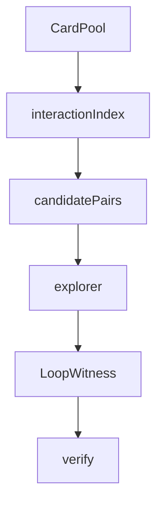

# search

## Purpose

Bounded discovery of `LoopWitness` candidates from semantic cards. Search may speculate; it never lives inside the verifier.

## Context

## What belongs here

- Pair enumeration from capability joins
- Bounded action search that emits witnesses
- Orchestration that feeds the same conservative verifier

## What does not belong here

- Known pair labels or gold lookup on the discovery path
- LLM-authored sequences
