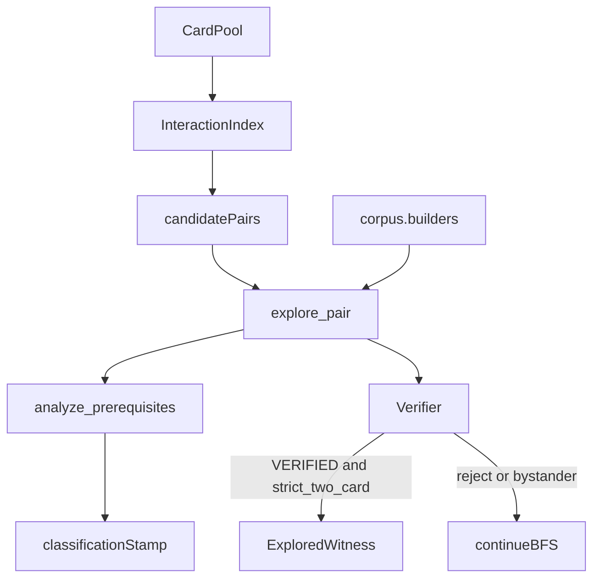

# search

## Purpose

Bounded discovery of `LoopWitness` candidates from semantic cards.

**Search proposes witnesses.** Acceptance physics live in `verify/`; this package applies the **participant gate** (`strict_two_card`) after the verifier returns.

The explorer calls an injected `Verifier` once per productive candidate as its acceptance oracle, then applies the participant gate before accepting. `discover_loops` trusts that single oracle pass.

## Role in pipeline

`InteractionIndex.candidate_pairs` + card pool → **THIS** → first verifier-accepted strict two-card `ExploredWitness` (or none) → eval / CLI.

## Inputs

- Semantic card pool (no gold pair labels)
- Candidate pairs from `interactions`
- Optional injected `Verifier`
- Bounds: `max_depth=6`, `max_states=4000` (defaults)

## Outputs

- `ExploredWitness` / `DiscoveryHit` / `DiscoveryReport`
- Witnesses stamped with `Classification.strict_two_card`, essential count, and prereq lists from `analyze_prerequisites`. `unused_oracle_ids` live on `PrerequisiteAnalysis` only — re-run classify to inspect them; they are **not** fields on `LoopWitness`.

## Responsibilities

- Bounded legal-action BFS (`explorer.explore_pair`)
- Seed lifelink / undying grants when partners need them (`seed_grant_lifelink`, `seed_grant_undying`)
- Seed **four** `p1p1` counters on cards whose mana ability scales with +1/+1 counters (Gyre Sage class), so counter-mana engines can pay Staff-class untap cycles (`{3}` untap creature + `{1}` untap Staff)
- For remove-counter `any_target` damage, emit activate steps with `target="opponent"` first (Heliod path); self (`actor`) is also legal for undying self-ping
- Seed a generic creature **aura host** (non-token setup permanent) when an activated ability uses `TapCost(source_self=False)` and neither essential is a creature (Presence of Gond + Intruder Alarm class); otherwise tap the partner creature. Host tap is tracked in `LoopRelevantState` so recurrence fails closed when the host stays tapped.
- When loop actions activate a `once_per_turn` ability, `derive_relevant_state`
  adds `permanents.<id>.once_per_turn_used.<ability_id>` as `EXACT` (helpers live in
  `verify.mandatory_recurrence`; the verifier re-applies them so omitting them from a
  hand-authored witness cannot bypass recurrence — ADR 0008). Pending trigger depth
  is likewise mandatory (`pending_triggers.count`).
- Orchestrate pool → pairs → explorer (`discover.discover_loops`)
- Reuse `corpus.builders` (`bf`, `two_card`) so witness shape matches gold
- Prune via `reusable_fingerprint` (`pruning.py`). Equality asserts search-equivalence for currently modeled future legal behavior: fingerprints include `summoning_sick`, `once_per_turn_used`, and trigger `subject_id`/`amount` (not only source+ability). Monotonic event counters alone do not change the fingerprint.
- Call verifier as the sole physics acceptance oracle on the discovery path
- **Participant gate:** accept only when `proof.status == VERIFIED` **and** `witness.classification.strict_two_card`; silently continue BFS otherwise

## Boundaries

| Concern | Owner |
| --- | --- |
| Human adjudication | `eval/` |
| Pair labels / gold lookup on the discovery path | Stay off this path (eval / corpus for labels) |
| Physics acceptance | Injected `Verifier` (single pass) |
| Verifier-side participant rejection | Optional follow-up; discovery already filters bystanders |

## Core invariants

### Candidate joins

Pairs come from `interactions.InteractionIndex` (capability complements + non-empty `join_reasons`). Search does not invent pairs outside that stream.

### Bounded exploration

BFS stops at depth/state limits; fingerprints avoid re-expanding reusable states. Limits are safety rails, not soundness proofs.

### Participant requirements

| Stage | Behavior |
| --- | --- |
| **Detection** | `build_witness` calls `analyze_prerequisites`, which fills `used_oracle_ids` / `unused_oracle_ids` / `strict_two_card` (including continuous cost-reduction participation). |
| **Enforcement** | `explore_pair` accepts only `VERIFIED` + `strict_two_card`. Bystander-verified sequences are skipped; BFS continues. |
| **Verifier** | Does not read `strict_two_card` / `unused_oracle_ids`. Physics/coverage/externals only. |
| **Evidence** | `tests/eval/test_classify_store.py` — five real Basalt bystander pairs → `None`; Basalt + Synthetic Cost Reducer still accepted. |

## Main entry points

| Module | Symbols |
| --- | --- |
| `discover.py` | `discover_loops`, `DiscoveryReport`, `DiscoveryHit` |
| `explorer.py` | `explore_pair`, `build_witness`, `legal_steps`, `default_initial_state` |
| `pruning.py` | `reusable_fingerprint` |

CLI: `mtg-loop-engine discover-gold`.

## Data contracts

Discovered witnesses carry `assumptions=["discovered_without_pair_labels", …]` and classification stamped from `analyze_prerequisites`. Accepted discoveries are always `strict_two_card=True` under current search policy. Pair keys from corpus are eval-only and must not be imported here.

## Failure behavior

Returns `None` / empty verified hits when bounds exhaust, the oracle rejects all candidates, or only bystander-verified sequences exist. Injected reject-all verifier ⇒ no hits (`tests/unit/test_explorer.py`).

## Testing

- `tests/discovery/` — physics blind recall; Oracle gold discovery (may be empty)
- `tests/unit/test_explorer.py` — oracle injection; no double-verify
- `tests/unit/test_search_boundary.py` — verify ↛ search
- `tests/eval/test_classify_store.py` — participant gate regressions

## Extension guide

1. Keep joins in `interactions/`; keep acceptance physics in `verify/`.
2. Prefer extracting `analyze_prerequisites` out of `eval` if the search↔eval import cycle becomes painful; keep verify independent of eval.
3. If hand-authored witnesses must also fail closed on bystanders, add a verifier gate (and typed status) in a deliberate follow-up.

## Bigger-picture relationship

Search proposes under a conservative verifier plus a participant acceptance filter. Architecture: [`docs/ARCHITECTURE.md`](../../../docs/ARCHITECTURE.md).
