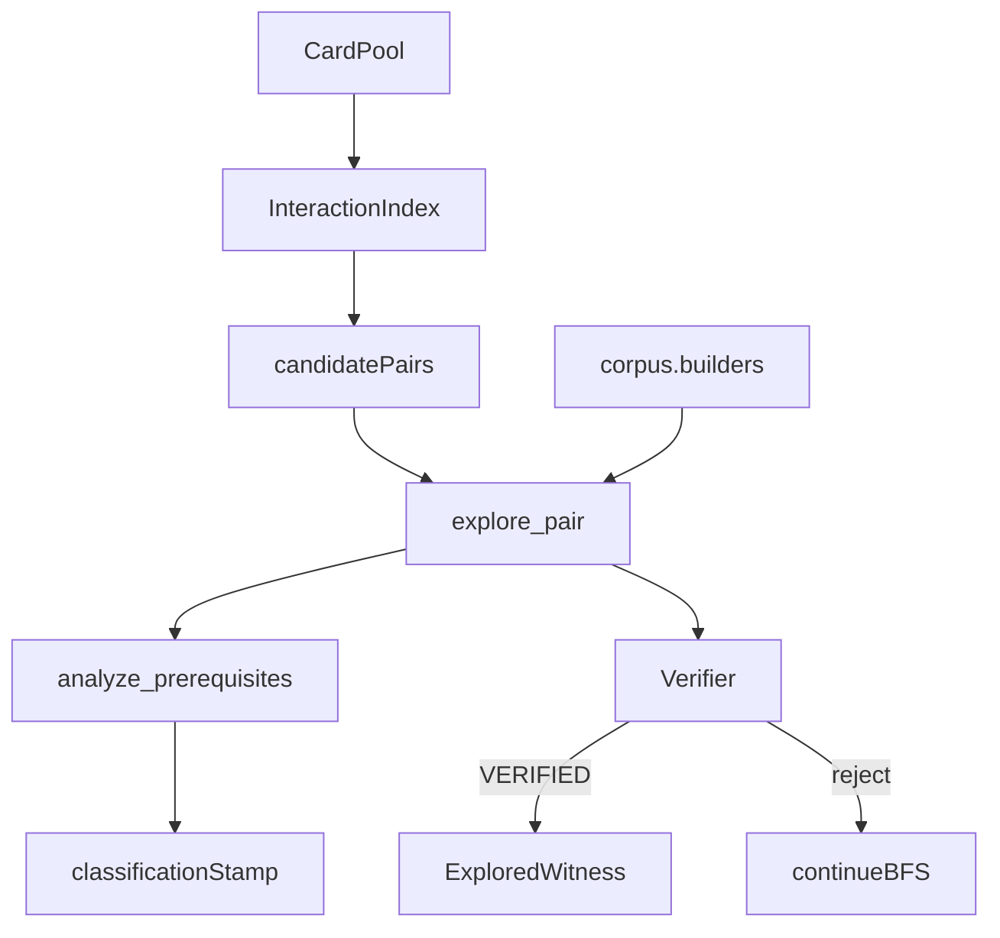

# search

## Purpose

Bounded discovery of `LoopWitness` candidates from semantic cards.

**Search proposes witnesses. It does not decide truth.**

The explorer calls an injected `Verifier` once per productive candidate as its acceptance oracle. `discover_loops` does not verify again.

## Role in pipeline

`InteractionIndex.candidate_pairs` + card pool → **THIS** → first verifier-accepted `ExploredWitness` (or none) → eval / CLI.

## Inputs

- Semantic card pool (no gold pair labels)
- Candidate pairs from `interactions`
- Optional injected `Verifier`
- Bounds: `max_depth=6`, `max_states=4000` (defaults)

## Outputs

- `ExploredWitness` / `DiscoveryHit` / `DiscoveryReport`
- Witnesses stamped with `Classification.strict_two_card`, essential count, and prereq lists from `analyze_prerequisites`. `unused_oracle_ids` live on `PrerequisiteAnalysis` only — re-run classify to inspect them; they are **not** fields on `LoopWitness`.

## Responsibilities

- Bounded legal-action BFS (`explorer.explore_pair`)
- Orchestrate pool → pairs → explorer (`discover.discover_loops`)
- Reuse `corpus.builders` (`bf`, `two_card`) so witness shape matches gold
- Prune via `reusable_fingerprint` (`pruning.py`)
- Call verifier as the sole acceptance oracle on the discovery path

## Non-responsibilities

- Final human truth or adjudication
- Owning pair labels / gold lookup on the discovery path
- A second verification pass after acceptance
- **Enforcing** participant / `strict_two_card` gates (see open defect)

## Core invariants

### Candidate joins

Pairs come from `interactions.InteractionIndex` (capability complements + non-empty `join_reasons`). Search does not invent pairs outside that stream.

### Bounded exploration

BFS stops at depth/state limits; fingerprints avoid re-expanding reusable states. Limits are safety rails, not soundness proofs.

### Participant requirements — detection vs enforcement (open defect)

| Stage | Behavior today |
| --- | --- |
| **Detection** | `build_witness` calls `mtg_loop_engine.eval.classify.analyze_prerequisites`, which fills `used_oracle_ids` / `unused_oracle_ids` / `strict_two_card` from which searched cards actually act in loop steps. Only `strict_two_card` (plus counts/prereqs) is stamped onto the witness; unused IDs require re-running classify. |
| **Enforcement** | **Not implemented.** `explore_pair` accepts the first sequence with `proof.status == VERIFIED`. Unused bystander cards in the searched pair still pass if the verifier likes the physics. |
| **Verifier** | Does not read `strict_two_card` / `unused_oracle_ids`. It rejects non-empty `functional_external_requirements`, but classify currently leaves that list empty for bystanders. |
| **Evidence** | `tests/eval/test_classify_store.py::test_basalt_altar_is_not_strict_two_card` — explore succeeds while `strict_two_card is False`. |
| **Product fix** | `ROADMAP.md` M4 follow-through: reject witnesses where an essential oracle ID never acts. |

Do not document participant filtering as shipped behavior until that gate exists.

## Main entry points

| Module | Symbols |
| --- | --- |
| `discover.py` | `discover_loops`, `DiscoveryReport`, `DiscoveryHit` |
| `explorer.py` | `explore_pair`, `build_witness`, `legal_steps`, `default_initial_state` |
| `pruning.py` | `reusable_fingerprint` |

CLI: `mtg-loop-engine discover-gold`.

## Data contracts

Discovered witnesses carry `assumptions=["discovered_without_pair_labels", …]` and classification stamped from `analyze_prerequisites` (`strict_two_card` label, not an acceptance gate). Pair keys from corpus are eval-only and must not be imported here.

## Failure behavior

Returns `None` / empty verified hits when bounds exhaust or the oracle rejects all candidates. Injected reject-all verifier ⇒ no hits (`tests/unit/test_explorer.py`).

## Testing

- `tests/discovery/` — blind recall 10/10; compiled seam
- `tests/unit/test_explorer.py` — oracle injection; no double-verify
- `tests/unit/test_search_boundary.py` — verify ↛ search
- `tests/eval/test_classify_store.py` — documents bystander acceptance

## Extension guide

1. Ship the participant filter before treating M5 `NOVEL` labels as trustworthy.
2. Keep joins in `interactions/`; keep acceptance physics in `verify/`.
3. Prefer extracting `analyze_prerequisites` out of `eval` if the search↔eval import cycle becomes painful — do not invert verify→eval.

## Bigger-picture relationship

Search is speculative proposal under a conservative verifier. Architecture: [`docs/ARCHITECTURE.md`](../../../docs/ARCHITECTURE.md).
