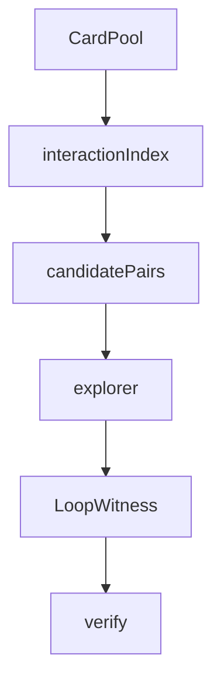

# search

## Purpose

Bounded discovery of `LoopWitness` candidates from semantic cards. Search may speculate; it never lives inside the verifier.

## Context

## What belongs here

- `discover.py`: orchestrates pool → pairs → explorer → verifier
- `explorer.py`: bounded legal-action BFS that emits witnesses
- `pruning.py`: reusable-state fingerprints

Pair enumeration is owned by `interactions/`; this package consumes those pairs.

## What does not belong here

- Known pair labels or gold lookup on the discovery path
- LLM-authored sequences
