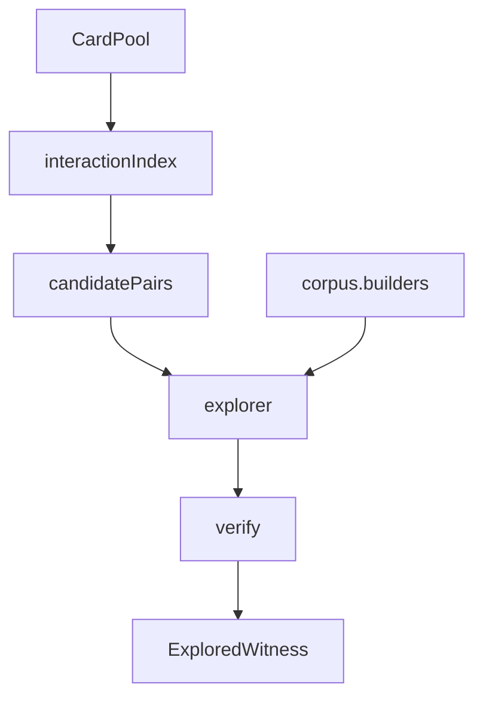

# search

## Purpose

Bounded discovery of `LoopWitness` candidates from semantic cards. Search may speculate; it never lives inside the verifier. The explorer calls the injected verifier once per productive candidate as its acceptance oracle; `discover_loops` does not verify again.

## Context

Explorer uses `corpus.builders` (`bf`, `two_card`) so discovered witnesses share gold's board and classification vocabulary. It does not import gold pair labels.

## What belongs here

- `discover.py`: orchestrates pool → pairs → explorer (verifier is the search oracle)
- `explorer.py`: bounded legal-action BFS that emits the first verifier-accepted witness
- `pruning.py`: reusable-state fingerprints

Pair enumeration is owned by `interactions/`; this package consumes those pairs.

## What does not belong here

- Known pair labels or gold lookup on the discovery path
- LLM-authored sequences
- A second verification pass after a witness is already accepted
