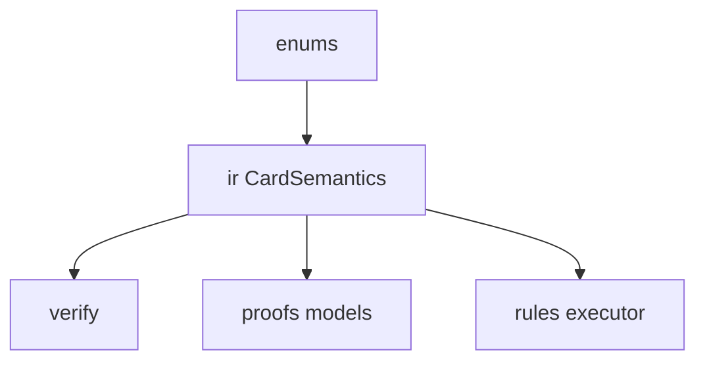

# semantics

## Purpose

Domain enums and intermediate representation (IR) for card abilities, costs, effects, and coverage tracking. Search and verification reason over these concepts, not Oracle strings.

## Context

## What belongs here

- `enums.py`, `ir.py`, manual fixture helpers consumed by `corpus/`

## What does not belong here

- Full Oracle text parser (M2+)
- LLM proposal paths (blocked through M3)
