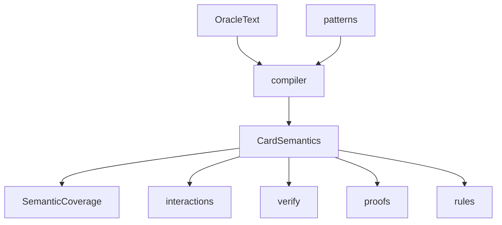

# semantics

## Purpose

Oracle language → deterministic intermediate representation (IR). Search and verification reason over `CardSemantics`, not raw Oracle strings.

## Role in pipeline

Oracle text / fixtures (`cards`, `oracle_fixtures`) → **THIS** → `interactions`, `rules`, `state`, `proofs`, `verify`, `search`, `corpus`, `eval`.

## Inputs

- `oracle_id`, name, oracle text, type line (and similar card metadata).
- Pattern library under `patterns/`.

## Outputs

- `CardSemantics` + ability IR (`ir.py`)
- `CompileReport` / aggregate coverage (`coverage.py`)
- `SemanticCoverage` on every compiled card

## Responsibilities

- Deterministic compile path (`compile_oracle_text`, `split_oracle_abilities`).
- Explicit coverage labeling for every compile result.
- Gold Oracle fixtures for seam tests (`oracle_fixtures.py`).

## Non-responsibilities

- Full Comprehensive Rules parsing
- LLM proposal paths (banned on any path to `VERIFIED`)
- Pair search or verification

## Core invariants

Coverage enum (`enums.SemanticCoverage`):

| Value | Meaning |
| --- | --- |
| `COMPLETE` | Every fragment matched a pattern |
| `PARTIAL_IRRELEVANT_TO_PROOF` | Gaps exist but caller marked them irrelevant to the proof |
| `PARTIAL_RELEVANT_TO_PROOF` | Gaps are treated as proof-relevant (**default** when unsupported fragments remain) |

**Fail closed for proof-relevant gaps.** Default `treat_unsupported_as_relevant=True` assigns `PARTIAL_RELEVANT_TO_PROOF`. The verifier rejects that coverage (and any `relevant_unsupported()` card) with `UNSUPPORTED_SEMANTICS` — it may never emit `VERIFIED`.

## Main entry points

| Module | Symbols |
| --- | --- |
| `compiler.py` | `compile_oracle_text`, `split_oracle_abilities` |
| `ir.py` | `CardSemantics`, costs/effects/abilities, `relevant_unsupported()` |
| `enums.py` | `SemanticCoverage`, proof/verification enums |
| `coverage.py` | `CompileReport`, `aggregate_coverage` |
| `oracle_fixtures.py` | `GOLD_ORACLE_FIXTURES`, unsupported fixture |
| `patterns/` | Ordered matchers |

CLI: `mtg-loop-engine compile-coverage`.

## Data contracts

`CardSemantics.coverage` must travel with the card into witnesses. Downstream must not silently upgrade partial coverage to complete. Discovery often leaves witness-level `LoopWitness.semantic_coverage` at its default (`COMPLETE`); fail-closed still relies on per-card `relevant_unsupported()` and any explicitly set witness coverage.

## Failure behavior

Unmatched clauses become unsupported fragments → `PARTIAL_RELEVANT_TO_PROOF` (default). **Empty Oracle text** is also fail-closed (no silent `COMPLETE`). No exception for ordinary incomplete text; the failure mode is coverage, then verifier rejection.

Real-Oracle curriculum under `real_oracle_curriculum.py` includes live Gravecrawler (cast-from-GY + Zombie) and historical activated-return stand-in.

## Testing

- `tests/semantic/test_compiler.py` (gold fixtures complete; unsupported scepter fails closed)
- `tests/semantic/test_compile_verify.py` (compile → verify seam)
- `tests/discovery/test_compiled_discovery.py` (compile → blind discovery)

## Extension guide

1. Add a deterministic pattern in `patterns/` for the unsupported family.
2. Prove it with a fixture/compiler test before claiming coverage wins.
3. Prefer real-Oracle fragments from Spellbook failure taxonomy (`ROADMAP.md` M4 follow-through) over gold-only wording.

## Bigger-picture relationship

Compiler is M2. Coverage gates M1 verification and M3/M4 eligibility. See [`docs/ARCHITECTURE.md`](../../../docs/ARCHITECTURE.md).
