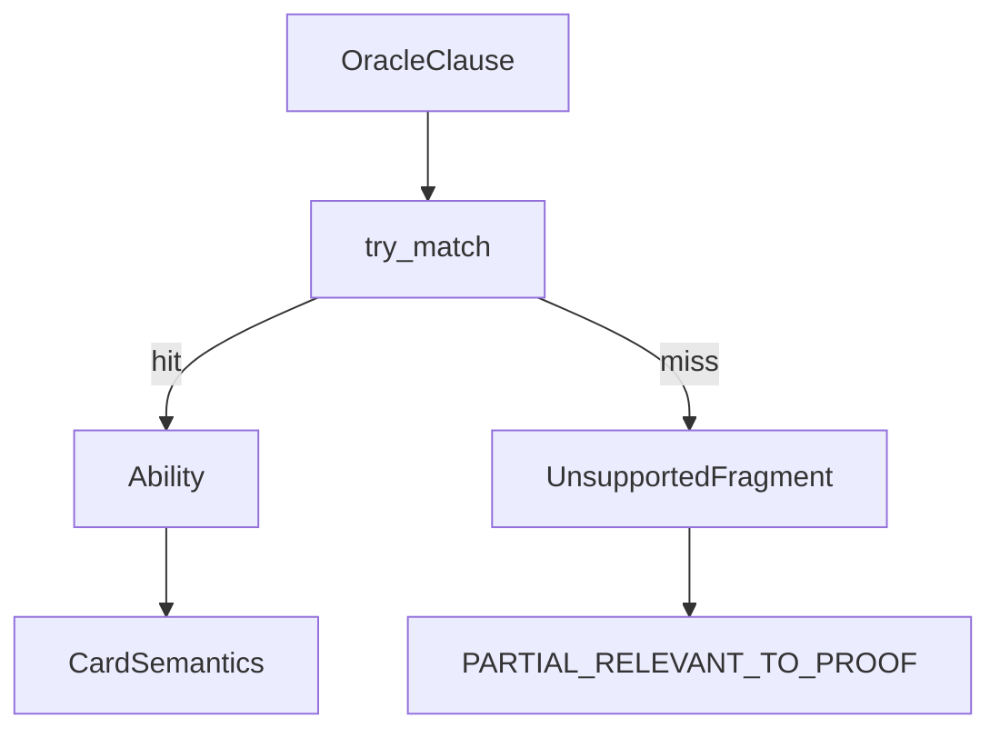

# patterns

## Purpose

Ordered, deterministic Oracle-clause matchers that feed the semantics compiler. First match wins; no fuzzy or LLM matching.

## Role in pipeline

Clause text (+ card name) → **THIS** → `(pattern_id, Ability) | None` → compiler coverage / IR abilities.

## Inputs

- Ability/clause strings from `compiler.split_oracle_abilities`
- Card name when patterns need self-reference

## Outputs

- Matched `(pattern_id, Ability)` or `None`

## Responsibilities

- Maintain the ordered `PATTERNS` registry and individual `pat_*` matchers.
- Encode only what the executor/verifier can honor.

## Non-responsibilities

- Coverage aggregation (compiler)
- Search joins or verification
- Partial/fuzzy NLP

## Core invariants

- Deterministic: same clause → same match or miss.
- Miss ⇒ unsupported fragment ⇒ fail-closed relevant coverage at compile time (default).
- **Proof-irrelevant statics** (keywords, Enchant/Equip lines, cast-restriction riders) compile as supported no-ops so they do not block Spellbook eligibility when loop mechanics are modeled.
- Patterns must not claim support the executor cannot run.

## Main entry points

- Pattern module exports: `PATTERNS`, `try_match`, individual `pat_*` functions

## Data contracts

Returned `Ability` instances must be valid IR for `rules.executor` and witness serialization.

## Failure behavior

`None` from `try_match` — never invent a partial ability. Failure surfaces as compiler coverage, then verifier `UNSUPPORTED_SEMANTICS` when relevant.

## Testing

Covered via `tests/semantic/test_compiler.py` (all gold fixtures compile `COMPLETE`; unsupported fixture fails closed).

## Extension guide

1. Add the narrowest pattern that matches real Oracle (not only gold fixture wording).
2. Place it in order so it does not shadow a more specific matcher incorrectly.
3. Add/extend a compiler test before merging.

## Bigger-picture relationship

Pattern growth is the main lever for Spellbook eligibility (today: 0 eligible in frozen baseline because real Oracle misses patterns). Parent contract: [`../README.md`](../README.md).
