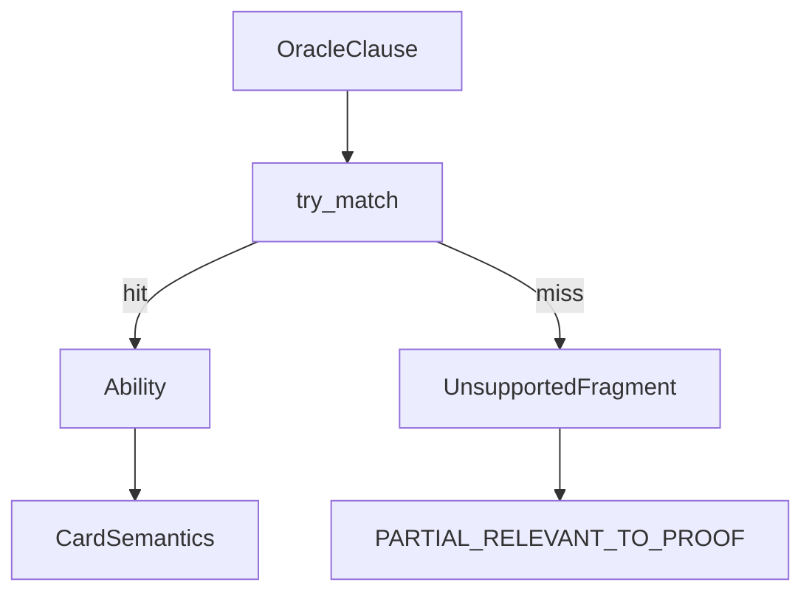

# patterns

## Purpose

Ordered, deterministic Oracle-clause matchers that feed the semantics compiler. First match wins; no fuzzy or LLM matching.

## Role in pipeline

Clause text (+ card name) → **THIS** → `(pattern_id, Ability) | None` → compiler coverage / IR abilities.

## Inputs

- Ability/clause strings from `compiler.split_oracle_abilities`
- Card name when patterns need self-reference

## Outputs

- Matched `(pattern_id, Ability)` or `None`

## Responsibilities

- Maintain the ordered `PATTERNS` registry and individual `pat_*` matchers.
- Encode only what the executor/verifier can honor.

## Non-responsibilities

- Coverage aggregation (compiler)
- Search joins or verification
- Partial/fuzzy NLP

## Core invariants

- Deterministic: same clause → same match or miss.
- Miss ⇒ unsupported fragment ⇒ fail-closed relevant coverage at compile time (default).
- **Proof-irrelevant statics** (keywords, Enchant/Equip lines, cast-restriction riders) compile as supported no-ops so they do not block Spellbook eligibility when loop mechanics are modeled.
- Patterns must not claim support the executor cannot run.
- Counter-scaled tap mana (`equal_to_source_p1p1_counters`) requires the executor to read `p1p1` on the source; explorer seeds four counters for that capability (Staff-class untap cycle).
- Power-scaled tap mana (`equal_to_source_power`) uses effective power; explorer seeds four `p1p1` when `mana_from_power` so Staff-class untap cycles clear `{3}` (Kami class).
- `amplify_p1p1_replacement` — Kami (permanent) / Hardened Scales (creature) “that many plus one”.
- Board-scaled tap mana (`mana_scale` / `ManaScaleKind`) counts creatures, elves, defenders, enchantments, devotion, or vivid colors; explorer may seed generic creature/elf/defender permanents when the scale needs mass (Staff-class untap cycle).
- **E01 gated tap-mana:** metalcraft / ferocious activation gates; hand-artifact scale (`HAND_ARTIFACTS` × multiplier); spend-only activate-abilities mana (`mana_activate_only` pool); `TapCreatureCost.quantity` (Supportive Parents).
- `enchanted_gain_life_put_that_many_p1p1` — Light of Promise / Sunbond; counters use `amount_from_trigger` on the enchanted host (`enchanted_creature` target).
- `gain_life_put_p1p1_each_controlled` / `etb_put_p1p1_each_controlled` — Archangel / Cathars; `each_controlled_creature` mass puts.
- `etb_other_human_put_p1p1_self` — Heronblade; Human subtype filter on ETB subject.
- `mana_create_token` — Sliver Queen `{N}: Create a P/T … token` (tap variant remains `tap_create_token`).
- `dies_gain_life_equal_toughness` — South Wind Avatar; DIES queue carries subject toughness as trigger amount.
- `etb_bounce_controlled_creature` — Drake / Lion; bounce a controlled creature to hand.
- `etb_bounce_controlled_creature_gw` — Fleetfoot; bounce green-or-white creature.
- `etb_bounce_controlled_permanent` — Dream Stalker; bounce any controlled permanent.
- `etb_bounce_controlled_nonland` — Ancestral Statue; bounce controlled nonland.
- `activated_bounce_other_creature` — Temur; paid bounce another creature (indestructible rider matched, proof-irrelevant).
- `activated_bounce_controlled_creature` — Chulane; `{N}, {T}` bounce controlled creature.
- `bounce_cost_untap_creature` — Quirion / Wirewood; bounce Forest/Elf cost → untap.
- `bounce_land_create_illusion` — Meloku; `{1}` + bounce land → Illusion token.
- `etb_bounce_sharing_type` — Cloudstone; nonartifact ETB → bounce another sharing a permanent type.
- `etb_mana_sharing_creature_type` — Mana Echoes; creature ETB → `{C}` × controlled sharing creature type.
- `earthcraft_tap_untap_basic` — Earthcraft; tap controlled creature → untap basic land.
- `enchanted_tap_create_token` — Gond / Nest; enchanted creature or land has `{T}`: create token (`TapCost.host`).
- `mana_untap_create_token` — Patrol Signaler; `{mana}, {Q}`: create token.
- `hybrid_remove_m1m1_pump` — Quillspike; `{B/G}` + remove −1/−1; pump until EOT proof-irrelevant.
- `counters_put_damage_opponent` — Shalai; COUNTER_ADDED on controlled creature → that-much damage (`amount_from_trigger`).
- `cast_bounce_target_permanent` — Tidespout; CAST → bounce target permanent.
- `etb_if_cast_half_life_drain` — Shard; ETB + `intervening_if=cast` → half-life lose + gain that much.
- `attacks_half_mill` / `spell_half_mill` — Traumatize / Fleet Swallower; mill ⌊/⌈ half library⌋.
- `cast_gain_life_per_spell` / `pay_life_damage` — Aetherflux Reservoir.
- `etb_untap_up_to_lands` / `tap_untap_n_lands` / `tap_untap_target_land` / `bounce_self_activated` — Palinchron / Drake / Argothian class.
- `scaled_mana_remainders` — Magus/Selvala/Kydele/Alena/Arbor/Bighorner mana scales.
- `cast_trigger_effects` — Birgi/Animar/Steam-Kin/Vivi/Forsaken CAST → effect family.
- `self_etb_scaled` — Redcap/Fanatic/Gary/Edgar self-ETB scaled damage/life/draw.
- `etb_untap_target` — Blasting Station may-untap-self; Hyrax untap target creature; Midnight Guard / Pestermite class.
- `warstorm_etb_power_damage` — Warstorm Surge; ETB subject power damage.
- `landfall_create_token` — Sporemound; controlled land ETB → token.
- `artifact_etb_p1p1_target` — Yotian Dissident; artifact ETB → p1p1.
- `dies_trigger_payoffs` — Plunderer/Sharpshooter/Teysa/Blood Artist/Pawn.
- `sac_outlet_payoffs` — Bombardment/Blasting Station/Altar/Golem/Ayara.
- `scaled_mill` — Keening / Mindcrank-scaled / Bruvac double mill.
- `etb_return_from_gy_to_hand` / `gy_to_hand_activated` / `dies_to_hand` — Witness/Salvagers/Renewal.
- `replacement_double_tokens` / `replacement_double_counters` — Parallel Lives / Doubling Season / Primal Vigor / Exalted Sunborn.
- `replacement_double_life_gain` / `replacement_double_opponent_life_loss` / `replacement_double_draw` / `static_cant_gain_life` — Archive / Bloodletter / Torment.
- `proliferate_activated` — Viral Drake paid Proliferate.
- `discard_untap_target` / `discard_add_mana` / `discard_draw` / `discard_trigger_damage` — Mind Over Matter / Skirge / Glint-Horn.
- `etb_create_eldrazi_tokens` / `mana_create_eldrazi_tokens` — Brood Monitor / Hatcher / Spawnsire.
- `enchantment_etb_create_cat` — Ajani's Chosen.
- `proliferate_activated` — Viral Drake paid Proliferate.
- `etb_or_attacks_create_token` — Squirrel Girl; ETB create (attacks not modeled).
- `mana_create_tokens_equal_subtype` — Squirrel Girl; `{cost}: Create X` equal to controlled subtype count.
- Wirewood Channeler matches scaled `BATTLEFIELD_ELF` any-color (slice-9 sibling).
- `aluren_free_cast` — Aluren; creatures MV ≤ N without paying mana.
- `instant_grant_tap_bounce` — Banishing Knack / Retraction Helix Instant grant.
- `etb_other_green_put_p1p1_target` — Ivy Lane; green color filter on ETB subject.
- `power_artifact_cost_reduction` — enchanted artifact activate −{N} (floor 1).
- `spell_cost_reduction` — E55: spells/creature spells cost less; affinity artifacts; Temur power≥N; Animar p1p1 scale.
- `static_cda_pt` / `nontoken_creatures_are_forests` — E56: */* CDAs; Ashaya Forests.
- `dealt_damage_draw` — Body of Knowledge; DEALT_DAMAGE → draw that many.
- `blink_activated` / `blink_etb` — E30a Emiel / Displacer / Felidar exile→return.
- `copy_activated_ability` / `copy_pending_trigger` — E32 Rings / Bracers / Strionic.
- `untap_all_nonlands` / `imprint_instant_etb` / `cast_imprinted_spell` / `copy_instant_or_sorcery_spell` — E33a Isochron / Dualcaster / Twincast.
- `dealt_damage_create_copy` / `fight_activated` / `etb_fight` — E74 Polyraptor / Brash / Apex.
- `additional_combat_untap_activated` / `combat_damage_untap_extra_combat` / `landfall_extra_combat` — E35 extra combat.
- `untap_mill_controller` — Mesmeric; UNTAP → self-mill.

## Main entry points

- Pattern module exports: `PATTERNS`, `try_match`, individual `pat_*` functions

## Data contracts

Returned `Ability` instances must be valid IR for `rules.executor` and witness serialization.

## Failure behavior

`None` from `try_match` — never invent a partial ability. Failure surfaces as compiler coverage, then verifier `UNSUPPORTED_SEMANTICS` when relevant.

## Testing

Covered via `tests/semantic/test_compiler.py` (all gold fixtures compile `COMPLETE`; unsupported fixture fails closed).

## Extension guide

1. Add the narrowest pattern that matches real Oracle (not only gold fixture wording).
2. Place it in order so it does not shadow a more specific matcher incorrectly.
3. Add/extend a compiler test before merging.
4. When adding a third sibling of an existing compound filter / mana-scale / ETB→counter
   family, prefer parameterization or structured IR over another one-off `pat_*` +
   filter string (`ROADMAP.md` §2b).

## Bigger-picture relationship

Pattern growth is the main lever for Spellbook eligibility (today: 0 eligible in frozen baseline because real Oracle misses patterns). Parent contract: [`../README.md`](../README.md).
