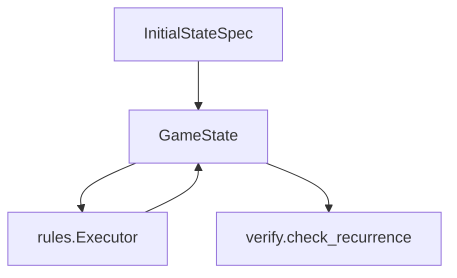

# state

## Purpose

Minimal battlefield / mana / life model that verification and search mutate while checking recurrence.

## Role in pipeline

`InitialStateSpec` (proofs) → **THIS (`GameState`)** → `rules.Executor` → recurrence path reads via `get_path`.

## Inputs

- `InitialStateSpec` / permanent specs from witnesses
- Mutations applied by the executor

## Outputs

- `GameState` copies for before/after comparison
- Path-addressable values for `LoopRelevantState` dimensions

## Responsibilities

- Represent permanents, mana pools, life, pending triggers, and event counters needed by the modeled rules surface.
- Track `damage_marked`, `lifelink`, and `undying` on `Permanent` for SBA / keyword physics (rules executor).
- Provide `from_spec`, `copy`, and `get_path` for recurrence.
- Path vocabulary used by `LoopRelevantState`: mana colors, life, events, permanent zone/tapped/counters/summoning_sick/`once_per_turn_used.<ability_id>`, `pending_triggers.count`, and battlefield counts (creature_tokens / creatures / artifacts).
- Path `permanents.<id>.once_per_turn_used.<ability_id>` → boolean (whether that ability id is marked used this turn).
- Path `pending_triggers.count` → length of the pending trigger queue (ADR 0008 mandatory).
- `Permanent.effective_toughness()` → toughness + p1p1 − m1m1 (None if no printed toughness).

## Non-responsibilities

- UI, decks, full zone model, multiplayer politics
- Deciding whether a loop is verified

## Core invariants

- Path API must stay stable for authored `relevant_state` dimensions.
- Copies must be deep enough that before/after recurrence is meaningful.

## Main entry points

- `game.py`: `Permanent`, `GameState`

## Data contracts

Aligns with `proofs.models.InitialStateSpec` and `LoopRelevantState` path strings (`EXACT` / `MINIMUM` / `MAXIMUM` comparisons live in verify).

## Failure behavior

Missing paths raise `KeyError` during recurrence → verifier rejects (`STATE_NOT_RECURRENT`).

## Testing

`tests/unit/test_recurrence.py` and explorer/gold suites.

## Extension guide

Add state fields only when recurrence or effects need them. Prefer proof-relevant dimensions over decorative board chrome.

## Bigger-picture relationship

State is the board algebra under verify/search. Architecture: [`docs/ARCHITECTURE.md`](../../../docs/ARCHITECTURE.md).
