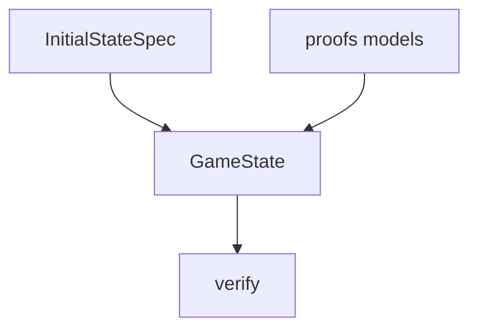

# state

## Purpose

Executable game state for witness replay: permanents, mana, life, event counters, and path resolution used by `LoopRelevantState`.

## Context

## What belongs here

- `game.py`: `Permanent`, `GameState`, `get_path` for recurrence dimensions

## What does not belong here

- Full multiplayer UI state or decklists
- Search / candidate generation
