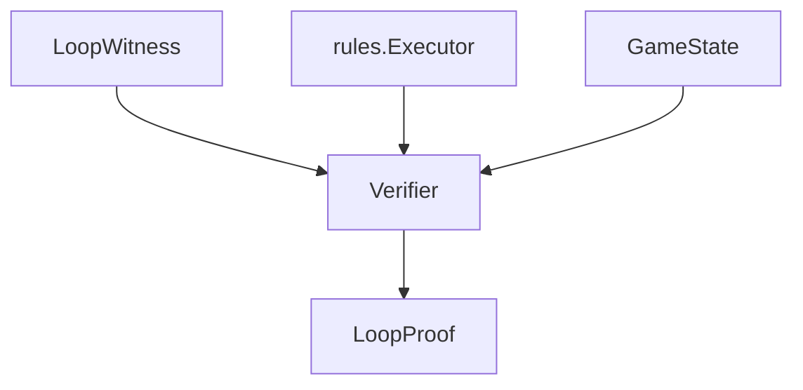

# verify

## Purpose

**The verifier is the acceptance boundary.**

Witness-in / proof-out. Search proposes witnesses and may call this package; this package must never import or embed search.

## Role in pipeline

`LoopWitness` → **THIS (`Verifier.verify`)** → `LoopProof` (`VERIFIED` or typed rejection).

## Inputs

- Fully formed `LoopWitness` (cards, IR, setup, loop actions, relevant state, expected outputs, classification, coverage)

## Outputs

- `LoopProof` with status, rejection reason (if any), recurrence details, proof hash, version identity

## Responsibilities

- Fail-closed semantic coverage gates
- Functional-external and essential-count gates
- Execute setup + loop via `rules.Executor`
- Check proof-specific recurrence (`LoopRelevantState`) plus **mandatory**
  dimensions (ADR 0008: once-per-turn usage, pending trigger count)
- Hash proofs for stability tracking

## Boundaries

| Concern | Owner |
| --- | --- |
| Candidate pair enumeration / action-space BFS | `search/` |
| Gold pair labels | `corpus/` / eval |
| Human adjudication | `eval/` |
| Participant / `strict_two_card` enforcement | `search.explore_pair` (this package judges physics/coverage/externals) |

## Core invariants

- Module contract: witness-in / proof-out verifier
- `PARTIAL_RELEVANT_TO_PROOF` or `card.relevant_unsupported()` → `UNSUPPORTED_SEMANTICS` (never `VERIFIED`)
- `PARTIAL_IRRELEVANT_TO_PROOF` may still `VERIFIED` if abilities are otherwise supported
- Non-empty `functional_external_requirements` → `EXTERNAL_FUNCTIONAL_PIECE_REQUIRED`
- Nondeterministic witnesses → typed rejection
- `verify` package must not import `search` (`tests/unit/test_search_boundary.py`)
- Participant gate is search-only; hand-authored bystander witnesses may still `VERIFIED`

## Main entry points

- `verifier.py`: `Verifier`, `Verifier.verify`, `check_recurrence`, `check_outputs`
  (claim hash via `proofs.claim.claim_proof_hash`)
- `mandatory_recurrence.py`: `effective_relevant_state`, once-per-turn / pending helpers

## Data contracts

Consumes `proofs.models.LoopWitness`; emits `LoopProof` with `VerificationStatus` / `ProofKind`. Proof hash covers witness identity + status + loop + outputs.

## Failure behavior

Always returns a `LoopProof` for ordinary verification attempts — typed rejection statuses rather than exceptions for loop/physics failures.

## Testing

- `tests/gold_core/` — positives `VERIFIED`
- `tests/hard_negatives/` — expected typed rejection
- `tests/semantic/test_compile_verify.py` — compile → verify
- `tests/unit/test_search_boundary.py` — layering
- `tests/golden_proofs/` — proof artifact contracts

## Extension guide

Add acceptance gates here when they are truth conditions (physics, coverage, externals). Exploration stays in `search/`. Participant enforcement for discovery lives in `search.explore_pair`; a verifier-side participant gate is an optional follow-up if hand-authored bystanders must also fail closed.

## Bigger-picture relationship

Verification checks a given witness. Architecture: [`docs/ARCHITECTURE.md`](../../../docs/ARCHITECTURE.md).
