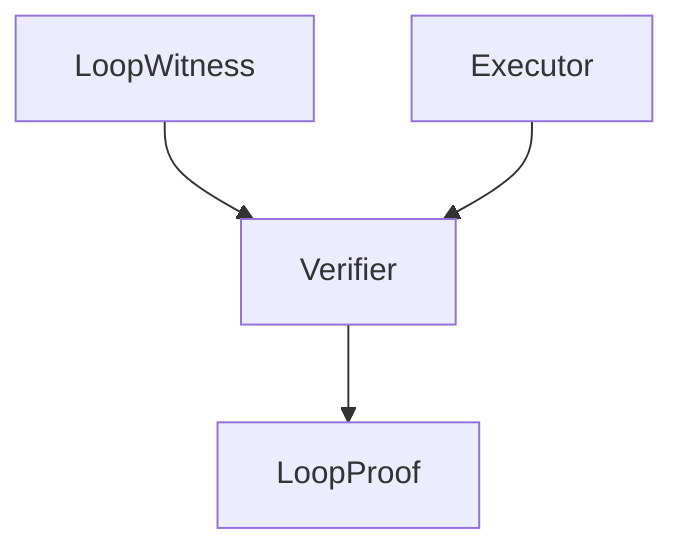

# verify

## Purpose

Witness-in / proof-out verifier. No search lives here.

## Context

## What belongs here

- `Verifier`, recurrence checks, fail-closed coverage gates

## What does not belong here

- Candidate pair search or action-space exploration (see `search/`)
- Gold pair labels
