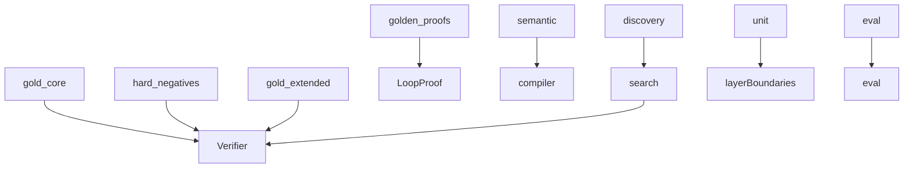

# tests

## Purpose

Pytest suites as executable epistemic contracts for M0–M4: positives, hard negatives, seams, regressions, and golden proofs.

## Role in pipeline

`mtg_loop_engine` + committed `eval/` artifacts → **THIS** → CI gate (`uv run pytest`).

## Inputs

- Library code under `src/mtg_loop_engine/`
- Corpus fixtures and eval artifacts

## Outputs

- Pass/fail assertions that encode product contracts

## Responsibilities

| Suite | Epistemic role |
| --- | --- |
| `gold_core/` | **Positives** — every gold witness → `VERIFIED` |
| `hard_negatives/` | **Hard negatives** — exact typed rejection |
| `gold_extended/` | Unsupported stubs stay unsupported |
| `golden_proofs/` | **Golden proofs** — JSON / hash / `normalize_proof` as executable artifacts |
| `semantic/` | Compiler coverage + compile→verify seam |
| `discovery/` | Blind recall + **M3.5 seam** (Oracle fixtures → compiler → discovery → verifier) |
| `unit/` | Helpers, joins, explorer oracle injection, **verify ↛ search** boundary |
| `eval/` | Classify detection, store, recovery sample, extras↔adjudications |

## Boundaries

| Concern | Owner |
| --- | --- |
| Witness definitions | `corpus/` |
| Scryfall/Spellbook downloads in CI | Out of CI; local `data/` snapshots only |
| Human adjudication | `eval/` workbench + committed adjudications |

## Core invariants

- Discovery tests keep known pairings off the explorer path.
- Boundary test: `verify` does not import `search`.
- Eval tests regress participant enforcement (bystander pairs rejected) and lock gold-extra adjudication coverage for the post-gate extras set.
- Tests assert **contracts**: status, typed rejection, rediscovery, coverage, hashes.

## Contract tests

**Critical path → suite:** verifier → `gold_core` / `hard_negatives`; compiler → `semantic`; discovery/seams → `discovery`; eval → `eval`; proof artifacts → `golden_proofs`; layer boundaries → `unit`.

Assert outcomes (`VerificationStatus`, typed reasons, rediscovery, coverage, hashes, join reasons). Pair positives with hard negatives for new acceptance behavior. Regress real adjudications when fixing precision bugs.

**Avoid:**
- `assert True` / “doesn’t throw” with no oracle
- mock-call-only tests
- duplicating gold cases without a new contract
- weakening expectations to green CI
- expanding patterns only to pass a test

**Coverage %:** CI requires **≥ 90%** line coverage on measured `mtg_loop_engine` modules (`pyproject.toml`). That floor is a backstop alongside contract suites. See [`.cursor/rules/test-quality.mdc`](../.cursor/rules/test-quality.mdc) and [`CONTRIBUTING.md`](../CONTRIBUTING.md).

Pytest mechanics (`--strict-markers`, `xfail_strict`, warnings-as-errors, coverage fail-under) are configured in `pyproject.toml`.

## Main entry points

- `pytest` from repo root
- CI: `.github/workflows/ci.yml`

## Data contracts

Tests assert statuses, hashes, and counts that must stay aligned with corpus and `eval/baseline`.

## Failure behavior

Any failure is a contract break. Prefer fixing engine or updating fixtures deliberately — do not weaken assertions to hide regressions.

## Testing

This directory *is* the test surface.

## Extension guide

1. New acceptance behavior → positive + hard-negative pair when possible.
2. New seam → put it under `discovery/` or `semantic/`, not only unit spies.
3. Participant filter (when implemented) → promote today’s classify bystander case into an enforcement regression.

## Bigger-picture relationship

Architecture: [`docs/ARCHITECTURE.md`](../docs/ARCHITECTURE.md).
