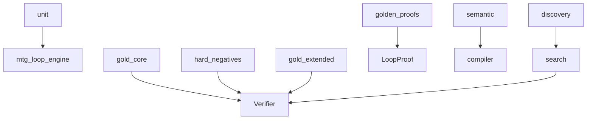

# tests

## Purpose

Pytest suites for M0–M3 gates: unit helpers, gold_core VERIFIED, hard-negative typed rejections, gold_extended UNSUPPORTED, golden proof JSON, semantic compiler, and blind discovery recall.

## Context

## What belongs here

- `test_*.py` under the subdirs below

## What does not belong here

- Authored witness definitions (live in `src/mtg_loop_engine/corpus/`)
