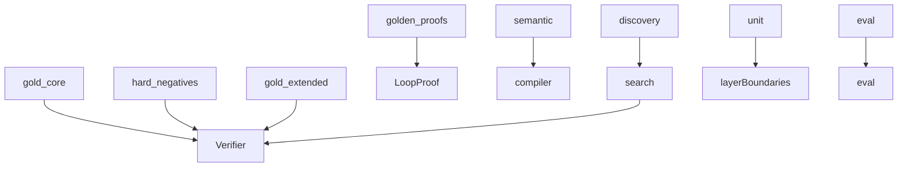

# tests

## Purpose

Pytest suites as executable epistemic contracts for M0–M4: positives, hard negatives, seams, regressions, and golden proofs.

## Role in pipeline

`mtg_loop_engine` + committed `eval/` artifacts → **THIS** → CI gate (`uv run pytest`).

## Inputs

- Library code under `src/mtg_loop_engine/`
- Corpus fixtures and eval artifacts

## Outputs

- Pass/fail assertions that encode product contracts

## Responsibilities

| Suite | Epistemic role |
| --- | --- |
| `gold_core/` | **Positives** — every gold witness → `VERIFIED` |
| `hard_negatives/` | **Hard negatives** — exact typed rejection, not mere failure |
| `gold_extended/` | Unsupported stubs stay unsupported |
| `golden_proofs/` | **Golden proofs** — JSON / hash / `normalize_proof` as executable artifacts |
| `semantic/` | Compiler coverage + compile→verify seam |
| `discovery/` | Blind recall + **M3.5 seam** (Oracle fixtures → compiler → discovery → verifier) |
| `unit/` | Helpers, joins, explorer oracle injection, **verify ↛ search** boundary |
| `eval/` | Classify detection, store, recovery sample, extras↔adjudications |

## Non-responsibilities

- Authoring witness definitions (live in `corpus/`)
- Downloading Scryfall/Spellbook in CI
- Replacing human adjudication

## Core invariants

- Discovery tests must not pass known pairings into the explorer.
- Boundary test forbids `verify` importing `search`.
- Eval tests may document bystander acceptance (`strict_two_card is False` with a found witness) until participant enforcement ships — that is a regression signal for the open defect, not proof the gate exists.

## Main entry points

- `pytest` from repo root
- CI: `.github/workflows/ci.yml`

## Data contracts

Tests assert statuses, hashes, and counts that must stay aligned with corpus and `eval/baseline`.

## Failure behavior

Any failure is a contract break. Prefer fixing engine or updating fixtures deliberately — do not weaken assertions to hide regressions.

## Testing

This directory *is* the test surface.

## Extension guide

1. New acceptance behavior → positive + hard-negative pair when possible.
2. New seam → put it under `discovery/` or `semantic/`, not only unit spies.
3. Participant filter (when implemented) → promote today’s classify bystander case into an enforcement regression.

## Bigger-picture relationship

Architecture: [`docs/ARCHITECTURE.md`](../docs/ARCHITECTURE.md).
