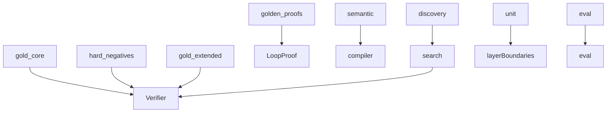

# tests

## Purpose

Pytest suites as executable epistemic contracts for M0–M4: positives, hard negatives, seams, regressions, and golden proofs.

## Role in pipeline

`mtg_loop_engine` + committed `eval/` artifacts → **THIS** → CI gate (`uv run pytest`).

## Inputs

- Library code under `src/mtg_loop_engine/`
- Corpus fixtures and eval artifacts

## Outputs

- Pass/fail assertions that encode product contracts

## Responsibilities

| Suite | Epistemic role |
| --- | --- |
| `gold_core/` | **Positives** — every gold witness → `VERIFIED` |
| `hard_negatives/` | **Hard negatives** — exact typed rejection |
| `gold_extended/` | Unsupported stubs stay unsupported |
| `golden_proofs/` | **Golden proofs** — JSON / hash / `normalize_proof` as executable artifacts |
| `semantic/` | Compiler coverage + compile→verify seam |
| `discovery/` | Blind recall + **M3.5 seam** (Oracle fixtures → compiler → discovery → verifier) |
| `unit/` | Helpers, joins, explorer oracle injection, **verify ↛ search** boundary |
| `eval/` | Classify detection, store, recovery sample, extras↔adjudications |

## Boundaries

| Concern | Owner |
| --- | --- |
| Witness definitions | `corpus/` |
| Scryfall/Spellbook downloads in CI | Out of CI; local `data/` snapshots only |
| Human adjudication | `eval/` workbench + committed adjudications |

## Core invariants

- Discovery tests keep known pairings off the explorer path.
- Boundary test: `verify` does not import `search`.
- Eval tests regress participant enforcement (bystander pairs rejected) and lock gold-extra adjudication coverage for the post-gate extras set.
- Tests assert **contracts**: status, typed rejection, rediscovery, coverage, hashes.

## Contract tests

This project treats tests as **executable epistemic contracts**. Pytest mechanics live in `pyproject.toml` `[tool.pytest.ini_options]`. Contributor merge coupling: [`CONTRIBUTING.md`](../CONTRIBUTING.md) (CI merge gate).

### Critical functionality (must be CI-covered)

When behavior changes, add or update tests in the suite that owns that contract:

| Critical path | Suite |
| --- | --- |
| Verifier accepts / rejects | `tests/gold_core/`, `tests/hard_negatives/`, relevant `unit/` |
| Compiler / patterns | `tests/semantic/` |
| Blind discovery / seams | `tests/discovery/` (+ semantic compile→verify) |
| Search ↛ verify boundary | `tests/unit/test_search_boundary.py` (and kin) |
| Eval / adjudication / recovery | `tests/eval/` |
| Proof shape / hash stability | `tests/golden_proofs/` |

Green CI is merge-OK only if this table’s row for the PR is exercised — see **CI merge gate** in [`CONTRIBUTING.md`](../CONTRIBUTING.md).

### Test placement

For a verifier/rules soundness bug, use the **lowest useful layer plus the highest claim-bearing layer** — do not mechanically triplicate every case.

| Layer | Answers | Examples |
| --- | --- | --- |
| **Unit** | Did the primitive rule execute correctly? | Invalid sacrifice target rejected; sickness blocks `{T}`; RIP suppresses `DIES`; exact trigger lookup |
| **Hard negative / verifier** | Can a crafted witness exploit the primitive and still earn `VERIFIED`? | Exact typed `VerificationStatus` on adversarial witnesses |
| **Discovery** | Could search rediscover this false interaction? | Once-per-turn Alarm reject; pruning / recurrence state that changes machine acceptance |

Add a layer only when it protects a **distinct** contract. Prefer the test that could catch a false `VERIFIED` when two options cover the same lines.

### Good tests

- Assert **outcomes**: `VerificationStatus`, typed rejection reasons, rediscovery counts, coverage enums, proof hashes, join reasons.
- Prefer **one clear contract** per test (or parametrize over corpus cases).
- Pair positives with hard negatives when adding acceptance behavior.
- Regress **adjudicated failures** with real witnesses when fixing precision bugs.

### Useless tests (do not add)

- Assertions that cannot fail meaningfully (`assert True`, empty bodies, “runs without exception” with no oracle).
- Tests that only prove a mock was called, without a domain outcome.
- Pure coverage padding for private helpers already exercised by gold/seam tests.
- Duplicating an existing gold_core/discovery case under a new name with no new contract.
- Weakening expected status/reason so a broken verifier still “passes.”
- Broadening modeled rules/patterns solely to green a test (expand deliberately with docs).

### Coverage % policy

CI enforces a **92% line-coverage floor** on measured `mtg_loop_engine` code (`--cov-fail-under=92` in `pyproject.toml`).

That floor is a **backstop**, not a substitute for the suites above. Raise coverage with real contract tests. A separate CI step reports **branch** coverage without a fail-under (so line and branch gates stay distinct).

Intentionally omitted from the %-gate (see `[tool.coverage.run] omit`): CLI entrypoint, Streamlit workbench, and network snapshot download helpers. Do not widen that omit list to green CI — raise coverage with real contract tests.

**95%** remains a subsequent milestone after soundness + recurrence/pruning contracts are in place and remaining misses are product-classified.

Pytest mechanics (`--strict-markers`, `xfail_strict`, warnings-as-errors, coverage fail-under) are configured in `pyproject.toml`.

## Main entry points

- `pytest` from repo root
- CI: `.github/workflows/ci.yml`

## Data contracts

Tests assert statuses, hashes, and counts that must stay aligned with corpus and `eval/baseline`.

## Failure behavior

Any failure is a contract break. Prefer fixing engine or updating fixtures deliberately — do not weaken assertions to hide regressions.

## Testing

This directory *is* the test surface.

## Extension guide

1. New acceptance behavior → positive + hard-negative pair when possible.
2. New seam → put it under `discovery/` or `semantic/`, not only unit spies.
3. Participant filter (when implemented) → promote today’s classify bystander case into an enforcement regression.

## Bigger-picture relationship

Architecture: [`docs/ARCHITECTURE.md`](../docs/ARCHITECTURE.md).
