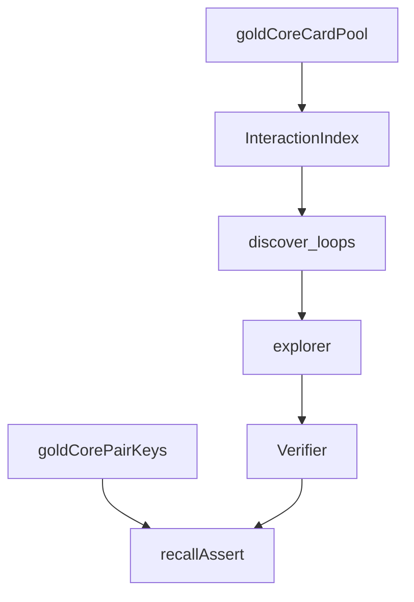

# discovery

## Purpose

Blind rediscovery and M3.5 seam tests: gold cards without pair labels still yield verifier-accepted witnesses; compiled Oracle fixtures rediscover gold_core.

## Role in pipeline

Card pool → joins → search → verifier → **THIS asserts recall**.

## Inputs

- Gold card pools / compiled pools
- Eval-only pair keys for recall scoring (not passed into explorer)

## Outputs

- Asserts on join coverage and 10/10 rediscovery

## Responsibilities

- Prove search does not need pair labels for gold_core.
- Prove compiler → discovery → verifier seam (M3.5).
- Prove real-Oracle curriculum pairs can rediscover when join + mana model align (`test_real_oracle_altar_gravecrawler.py`).

## Non-responsibilities

- Tests that inject known pairings into the explorer
- Replacing participant-gate regressions (those live in `tests/eval/test_classify_store.py`)

## Core invariants

- No gold pair keys on the discovery path.
- Injected verifier remains the physics acceptance oracle; search also requires `strict_two_card`.

## Main entry points

- `test_blind_discovery.py`
- `test_compiled_discovery.py`

## Data contracts

Discovery hits align with gold pair keys for recall only.

## Failure behavior

Missed gold pairs fail CI.

## Testing

This suite.

## Extension guide

When adding gold_core positives, extend recall expectations here.

## Bigger-picture relationship

Parent: [`../README.md`](../README.md). Search contract: [`../../src/mtg_loop_engine/search/README.md`](../../src/mtg_loop_engine/search/README.md).
