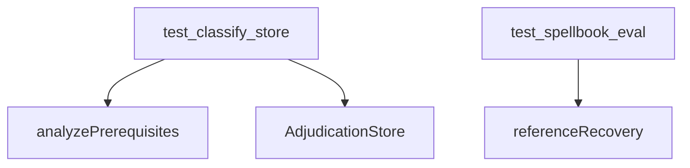

# eval

## Purpose

Tests for M4 evaluation: prerequisite analysis, DuckDB/JSONL store, Spellbook sample recovery, and gold-extra adjudication coverage.

## Context

## What belongs here

- Fast tests with gold IR and the committed Spellbook-shaped sample
- `test_classify_store.py`: prerequisite analysis and DuckDB/JSONL roundtrip
- `test_spellbook_eval.py`: sample recovery plus gold-extra adjudication coverage

## What does not belong here

- Streamlit UI automation
- Committed bulk Oracle JSON
