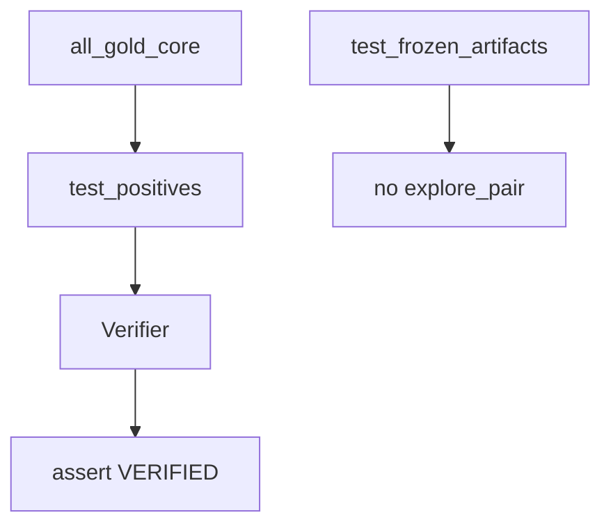

# gold_core

## Purpose

**Positive** epistemic contracts for Oracle-exact `gold_core`: every frozen
Oracle witness must verify. These tests are executable product truth, not smoke
coverage. Physics positives are covered under CLI `verify-physics` / discovery
physics suites, not this folder’s product claim.

## Role in pipeline

Frozen `corpus.gold_core` artifacts → **THIS** → `Verifier` → assert `VERIFIED`.

## Inputs

- `all_gold_core()` witnesses from `mtg_loop_engine.corpus` (Oracle-only, frozen JSON)

## Outputs

- Parametrized pytest pass/fail (currently **7** Oracle positives)
- Load-path contract: gold loader must not call search

## Responsibilities

- Lock Oracle gold positives as a permanent regression anchor.
- Fail loudly on any status other than `VERIFIED`.
- Prove gold fixtures load without rediscovery.

## Non-responsibilities

- Hard-negative typing (`../hard_negatives/`)
- Blind discovery recall (`../discovery/`) — positives here prove verify, not rediscovery
- Physics fixture regression (`verify-physics` / `physics_all_positives`)
- Authoring / re-freezing witnesses (`scripts/freeze_gold_witnesses.py` + `corpus/.../witnesses/`)

## Core invariants

- Status must be `VERIFIED` for each positive — no partial credit.
- Witness identities stay aligned with corpus / golden proofs.
- `all_gold_core` source and runtime must not invoke `explore_pair`.

## Main entry points

- `test_positives.py`
- `test_frozen_artifacts.py`
- `test_heliod_demotion.py`

## Data contracts

Witness IDs/status align with corpus and CLI `verify-gold`.

## Failure behavior

Any non-verified positive fails CI. Treat as a contract break, not flaky noise.

## Testing

This suite.

## Extension guide

Add parametrized cases only when corpus gains a deliberate new Oracle positive
(and update discovery recall in the same change). Re-freeze JSON via the script;
do not restore promote-at-import.

## Bigger-picture relationship

Parent: [`../README.md`](../README.md). Corpus: [`../../src/mtg_loop_engine/corpus/gold_core/README.md`](../../src/mtg_loop_engine/corpus/gold_core/README.md).
