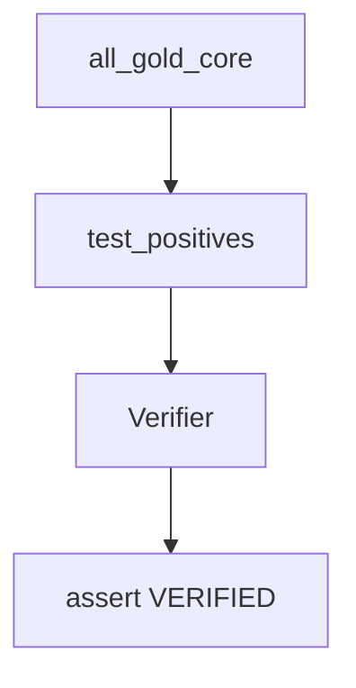

# gold_core

## Purpose

**Positive** epistemic contracts: every curated gold_core witness must verify. These tests are executable product truth, not smoke coverage.

## Role in pipeline

`corpus.gold_core` positives → **THIS** → `Verifier` → assert `VERIFIED`.

## Inputs

- `all_gold_core()` witnesses from `mtg_loop_engine.corpus`

## Outputs

- Parametrized pytest pass/fail

## Responsibilities

- Lock the M1 positive spine as a permanent regression anchor.
- Fail loudly on any status other than `VERIFIED`.

## Non-responsibilities

- Hard-negative typing (`../hard_negatives/`)
- Blind discovery recall (`../discovery/`) — positives here prove verify, not rediscovery
- Authoring witnesses (lives in `corpus/`)

## Core invariants

- Status must be `VERIFIED` for each positive — no partial credit.
- Witness identities stay aligned with corpus / golden proofs.

## Main entry points

- `test_positives.py`

## Data contracts

Witness IDs/status align with corpus and CLI `verify-gold`.

## Failure behavior

Any non-verified positive fails CI. Treat as a contract break, not flaky noise.

## Testing

This suite.

## Extension guide

Add parametrized cases only when corpus gains a deliberate new positive (and update discovery recall in the same change).

## Bigger-picture relationship

Parent: [`../README.md`](../README.md). Corpus: [`../../src/mtg_loop_engine/corpus/gold_core/README.md`](../../src/mtg_loop_engine/corpus/gold_core/README.md).
