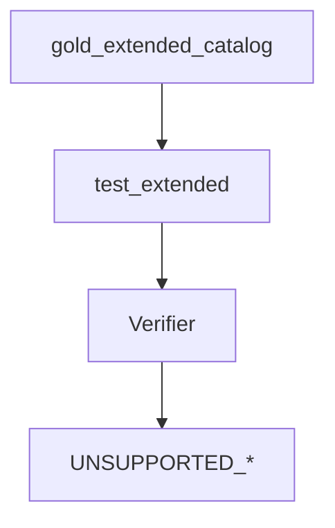

# gold_extended

## Purpose

**Unsupported curriculum** contracts: stub witnesses for partial-relevant / unsupported families must stay non-`VERIFIED` until deliberately promoted. This is not a stale M1 exit gate — it remains the honest gap ledger through M4 pattern work.

## Role in pipeline

`gold_extended` catalog → **THIS** → verifier unsupported-style outcomes.

## Inputs

- Extended stub witnesses from corpus

## Outputs

- Pytest pass/fail on expected unsupported/rejection behavior

## Responsibilities

- Keep the unsupported curriculum honest as patterns grow.
- Surface accidental over-matching (stub suddenly verifies).

## Non-responsibilities

- Promoting stubs to gold_core (manual corpus change + positives + discovery recall)
- Measuring Spellbook eligibility (eval/baseline)

## Core invariants

- Fail-closed coverage gaps stay non-`VERIFIED` until intentionally promoted.
- Expected statuses are unsupported / rejection typed (`UNSUPPORTED_SEMANTICS` / `UNSUPPORTED_RULE` class outcomes).

## Main entry points

- `test_extended.py`

## Data contracts

Align with corpus extended catalog expected statuses.

## Failure behavior

Unexpected `VERIFIED` fails the suite — either promote deliberately or fix an over-eager pattern.

## Testing

This suite.

## Extension guide

Add a stub test when recording a new unsupported family from real-Oracle / Spellbook failure taxonomy.

## Bigger-picture relationship

Parent: [`../README.md`](../README.md). Corpus: [`../../src/mtg_loop_engine/corpus/gold_extended/README.md`](../../src/mtg_loop_engine/corpus/gold_extended/README.md).
