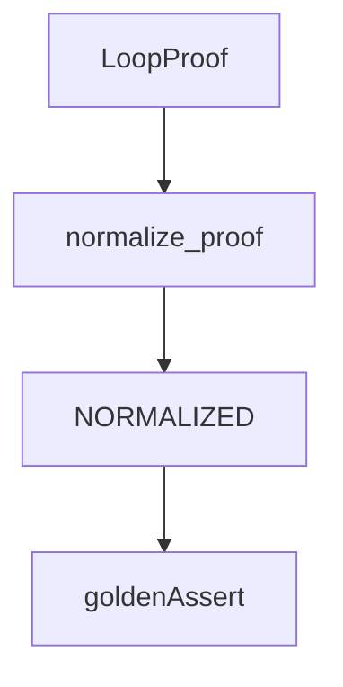

# golden_proofs

## Purpose

Treat proof JSON, hashes, and `normalize_proof` output as **executable epistemic artifacts** — golden contracts for serialization stability.

## Role in pipeline

Verified proofs / fixtures → **THIS** → assert normalized form and hash stability.

## Inputs

- Proof objects / committed golden JSON as defined by the tests

## Outputs

- Pass/fail on normalize kind, content, and hash expectations

## Responsibilities

- Catch accidental proof schema or hashing churn.

## Non-responsibilities

- Discovering loops
- Human adjudication prose

## Core invariants

- Normalization is deterministic.
- Proof hash changes are deliberate contract changes.

## Main entry points

- Golden proof tests in this directory

## Data contracts

`proofs.normalize.normalize_proof` and `proof_hash` behavior.

## Failure behavior

Drift fails CI; update goldens only with an intentional schema/version change.

## Testing

This suite.

## Extension guide

When changing proof models, update goldens in the same PR and note why in the commit/PR body.

## Bigger-picture relationship

Parent: [`../README.md`](../README.md). Models: [`../../src/mtg_loop_engine/proofs/README.md`](../../src/mtg_loop_engine/proofs/README.md).
