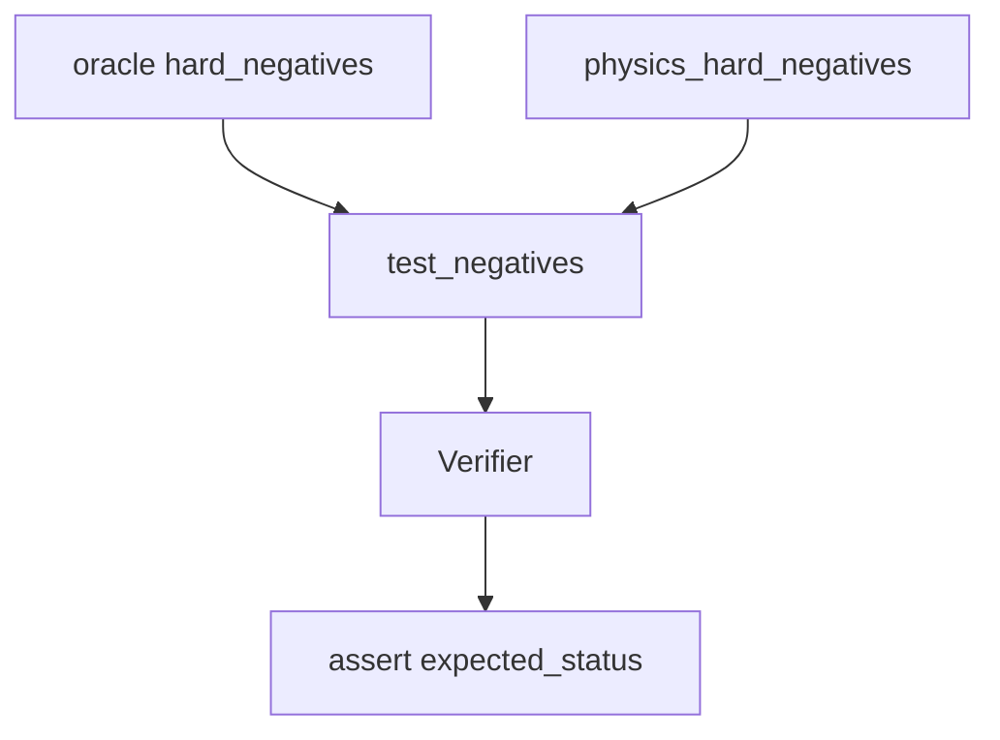

# hard_negatives

## Purpose

**Hard-negative** epistemic contracts: each witness must fail with its **expected typed status**, not merely “not verified.” Wrong rejection reasons are product bugs.

## Role in pipeline

Corpus hard negatives → **THIS** → `Verifier` → assert exact `VerificationStatus`.

## Inputs

- Oracle HN from `corpus.gold_core.hard_negatives` (currently **7**)
- Physics HN from `corpus.physics_fixtures` (currently **10**)

## Outputs

- Parametrized pytest pass/fail for both suites

## Responsibilities

- Prevent silent status drift (e.g. `RESOURCE_DEFICIT` becoming a generic illegal-action failure).
- Keep the typed rejection vocabulary honest across Oracle and physics rails.

## Non-responsibilities

- Positive `VERIFIED` checks (`../gold_core/`)
- Adjudication of novel discoveries (`../eval/`)

## Core invariants

- Typed rejection vocabulary is part of the product contract.
- Mere rejection without the expected status fails the suite.

## Main entry points

- `test_negatives.py` (Oracle + physics parametrized cases)

## Data contracts

Statuses match `semantics.enums.VerificationStatus` / corpus expectations.

## Failure behavior

Wrong status fails even if the witness is rejected.

## Testing

This suite.

## Extension guide

When adding a new rejection mode, add a hard negative that uniquely demands it
(Oracle promotion HN or physics regression HN as appropriate).

## Bigger-picture relationship

Parent: [`../README.md`](../README.md). Oracle:
[`../../src/mtg_loop_engine/corpus/gold_core/README.md`](../../src/mtg_loop_engine/corpus/gold_core/README.md).
Physics: [`../../src/mtg_loop_engine/corpus/physics_fixtures/README.md`](../../src/mtg_loop_engine/corpus/physics_fixtures/README.md).
